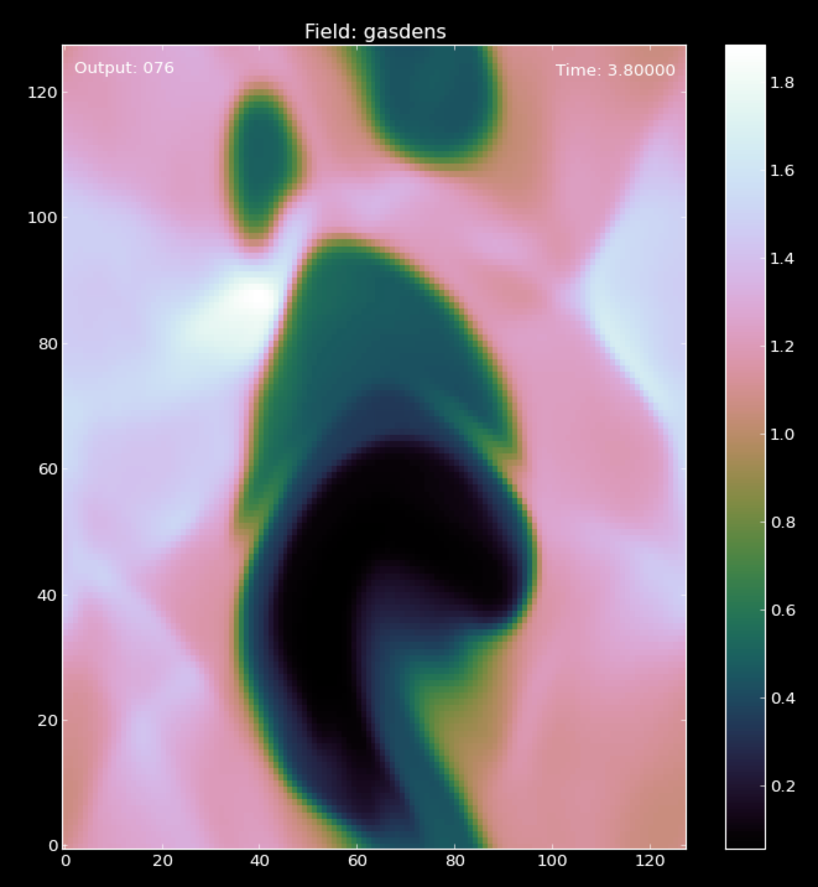

Developing a complex setup
===========================

This is the advanced part of the manual. After this section, you will
be able to develop kernels, and complex routines inside FARGO3D.

One of the most useful features of FARGO3D is the fact that you do not
have to develop CUDA kernels yourself, neither even learn CUDA. All
the CUDA code is written automatically with the help of
``scripts/c2cuda.py``.

But developing FARGO3D is not only a matter of kernels. We will not
write an extensive documentation on each topic, but instead, we will
develop a routine in detail and, at the same time, give a brief
explanation .

We will develop routines for simulating an exploding 2D periodic
media, where the explosions are governed by a random generator, and we
will develop a cooling function for the gas. This cooling function
will be a kernel. The explosions will be modeled by energy spheres,
appearing at random positions, and at random times. Also, we will
include a magnetic field.

The name of our setup will be "explosions".

Setup folder
-------------

The very first step is to create the directory to store the setup. We
will store all the files inside setups/explosions. This setup is
similar to the otvortex setup, so we can copy all the files inside
this setup and modify them.  We need to keep ``explosions.bound.0,explosions.opt, explosions.par`` and ``condinit.c`` files::

  $ cd setups
  $ mkdir explosions
  $ cp otvortex/* explosions/
  $ cd explosions
  $ mv otvortex.par explosions.par
  $ mv otvortex.opt explosions.opt ... etc for all files that begin with 'otvortex'

Do not forget to change the ``outputdir`` and the ``SetUp`` parameter
of the .par file (OutputDir outputs/explosions, SetUp
explosions). Also, we will add some viscosity and resistivity to our
setup (add the option ``-DVISCOSITY`` to the .opt file, and set
nu=0.001 and eta=0.001 in the parfile).

We can check that the setup can run::

  $ make SETUP=explosions view
  $ ./fargo3d setups/explosions/explosions.par

We see the otvortex setup, but with the name explosions.

Initial Condition
-----------------

Because we want explosions at random times, this kind of setup cannot
be entirely dealt with in ``condinit.c``. We will develop in the next
section an additional routine, called from the main loop, to handle
explosions. In the initial conditions we define a first explosion, at
a random position.  The routine that we will create in the next
section will resemble this one, which we write in the file
``setups/explosions/condinit.c``. It should be similar to::

	#include "fargo3d.h"
	
	void Init() {
	
	  int i,j,k;
	  real  yr, zr, yr0, zr0;
	  int   yi, zi;
	
	  real* vx = Vx->field_cpu;
	  real* vy = Vy->field_cpu;
	  real* vz = Vz->field_cpu;
	  real* bx = Bx->field_cpu;
	  real* by = By->field_cpu;
	  real* bz = Bz->field_cpu;
	  real* rho = Density->field_cpu;
	  real* e = Energy->field_cpu;

	  real sphere_radius = 0.05;

	  yr = YMIN+drand48()*(YMAX-YMIN);
	  zr = ZMIN+drand48()*(ZMAX-ZMIN);	
	  yr0 = yr;
	  zr0 = zr;
	  
	  if (yr > YMIN + (YMAX-YMIN)/2.0) 
	     yr -= (YMAX-YMIN);
	  else 
	     yr += (YMAX-YMIN);
	  if (zr > ZMIN + (ZMAX-ZMIN)/2.0) 
	     zr -= (ZMAX-ZMIN);
	  else 
	     zr += (ZMAX-ZMIN);
	  
	  sphere_radius *= sphere_radius; //we take the square. 
	
	  for (k=0; k<Nz+2*NGHZ; k++) {
	    for (j=0; j<Ny+2*NGHY; j++) {
	      for (i=0; i<Nx; i++) {
		rho[l] = e[l] = 1.0;
		vx[l] = vy[l] = vz[l] = 0.0;
		bx[l] = by[l] = 0.0;
		bz[l] = 0.1;
	        if ((Ymed(j)-yr)*(Ymed(j)-yr) + (Zmed(k)-zr)*(Zmed(k)-zr) <= sphere_radius) 
		  e[l] = 5.0;
	        if ((Ymed(j)-yr0)*(Ymed(j)-yr0) + (Zmed(k)-zr)*(Zmed(k)-zr) <= sphere_radius) 
		  e[l] = 5.0;
	        if ((Ymed(j)-yr)*(Ymed(j)-yr) + (Zmed(k)-zr0)*(Zmed(k)-zr0) <= sphere_radius) 
		  e[l] = 5.0;
	        if ((Ymed(j)-yr0)*(Ymed(j)-yr0) + (Zmed(k)-zr0)*(Zmed(k)-zr0) <= sphere_radius) 
		  e[l] = 5.0;
	      }
	    }
	  }
	}

	void CondInit() {
	   Fluids[0] = CreateFluid("gas",GAS);
           SelectFluid(0);
           Init();
        }

.. note:: 
   the four tests account for the periodicity of the mesh, as they
   take into account the main explosion and its replica in the
   neighboring domains.

Time dependent explosions
-------------------------

Now, we want to add explosions at random times in our simulation. This
should be done at the end of each DT.  Remember that ``DT`` is a
parameter chosen by the user in the parameter file, that sets the fine
grain temporal resolution of the code. It is not the time step imposed
by the CFL condition, which is usually (which should be, at least)
much shorter than DT.

The loop of time steps of total length DT is performed in ``AlgoGas
()``, in the file ``src/algogas.c``.
``AlgoGas()`` is invoked in ``src/main.c``, so we need to call our
explosions just there, after the execution of AlgoGas. You can see that
``AlgoGas()`` is invoked with the pointer ``&PhysicalTime`` (so that
the value of this variable can be modified from within the routine).

Here we want an explosion rate that is constant in time, so that the
date does not matter to determine whether an explosion takes place or
not. Our new routine therefore just needs to know the time interval at
which it is called, which is ``DT``. There is normally no need to pass
this variable as an argument, since it is a global upper case variable
that can be invoked anywhere in the C code.

So, the invocation of our new routine in ``src/main.c`` should be similar to::

  ...

  AlgoGas(&PhysicalTime);

  OurNewRoutine();  // Actually: Explode (); (see below)

  MonitorGlobal...

  ...

Since we want to amend ``main.c`` and ``algogas.c``, it is a good idea
to copy these files to out setup directory in order not to interfere
with the main version of FARGO3D. This way, everything we develop for
this complex kernel is self-contained within the setup
directory. There is a drawback, however: if we improve the main file
``src/algogas.c`` at some later stage, this improvement will not be
reflected in the file ``setups/explosions/algogas.c`` until we
implement it manually in this file.

The name of the new routine will be ``Explode()``, and will be stored
in the ``setups/explosions/condinit.c`` file::

	void Explode() {
	
	  INPUT(Energy);
	  OUTPUT(Energy);
	
	  int i,j,k;
	  real  yr, zr;
	  int   yr0, zr0;
	  real  p;	
	  real* e = Energy->field_cpu;

	  real Rate = 1.0; //Average number of explosions per unit time
	  real sphere_radius = 0.05;

	  sphere_radius *= sphere_radius; //we take the square. 
	
	  p = drand48();
	  if (p < 1.0-exp(-DT*Rate)) {
	  real sphere_radius = 0.1;

	  yr = YMIN+drand48()*(YMAX-YMIN);
	  zr = ZMIN+drand48()*(ZMAX-ZMIN);	
	  yr0 = yr;
	  zr0 = zr;
	  
	  if (yr > YMIN + (YMAX-YMIN)/2.0) 
	     yr -= (YMAX-YMIN);
	  else 
	     yr += (YMAX-YMIN);
	  if (zr > ZMIN + (ZMAX-ZMIN)/2.0) 
	     zr -= (ZMAX-ZMIN);
	  else 
	     zr += (ZMAX-ZMIN);
	  
	  sphere_radius *= sphere_radius; //we take the square. 
	
	  for (k=0; k<Nz+2*NGHZ; k++) {
	    for (j=0; j<Ny+2*NGHY; j++) {
	      for (i=0; i<Nx; i++) {
	        if ((Ymed(j)-yr)*(Ymed(j)-yr) + (Zmed(k)-zr)*(Zmed(k)-zr) <= sphere_radius) 
		  e[l] = 5.0;
	        if ((Ymed(j)-yr0)*(Ymed(j)-yr0) + (Zmed(k)-zr)*(Zmed(k)-zr) <= sphere_radius) 
		  e[l] = 5.0;
	        if ((Ymed(j)-yr)*(Ymed(j)-yr) + (Zmed(k)-zr0)*(Zmed(k)-zr0) <= sphere_radius) 
		  e[l] = 5.0;
	        if ((Ymed(j)-yr0)*(Ymed(j)-yr0) + (Zmed(k)-zr0)*(Zmed(k)-zr0) <= sphere_radius) 
		  e[l] = 5.0;
	      }
	    }
	  }
	}
      }

.. note::
   The variable ``Rate`` selects the rate at which explosions take
   place. In the case in which :math:`\textrm{Rate*DT} \ll 1`, we tend
   towards a Poissonian statistics of explosions. When this condition
   is not fulfilled, the statistics departs from Poisson's statistics
   because we can only have one explosion per DT.

.. warning:: We work on the physical coordinates rather than on the
   indices so that the size of the spheres is independent of
   resolution, and so that the output is independent on the number of
   processors (this requires however that they all have the same
   sequence of random numbers, hence that they have the same initial
   seed).

Now, if you type ``make``, all the code will be rebuilt.

Note we have added the INPUT/OUTPUT directives. INPUT/OUTPUT are
useful macrocommands that synchronizes the host and device memory if
it is needed (see :ref:`gpucomm`.). For example, if you run this setup
on the CPU, all the data is all the time on the CPU, but instead if
you run this setup on the GPU, before the execution of Explode(), it
is possible that the Field Energy is not fresh on the CPU, because all
the calculation was done on the GPU.

We could develop this routine as a kernel routine, with some suitable
structure for c2cuda.py; but in practice, this routine only works with
a few threads (all the threads inside a small circle), and the
remaining threads will stay idle. So, we can pay the cost of a
communication without committing a big mistake, and run the routine on
the CPU. Besides, and more importantly, it does not run within the
hydro/MHD loop, but once in a while.

Anyway, you can try a better implementation if you wish, but it is
not very important here.

Next, we develop a massively parallel function for the cooling
(damping of internal energy).

Damping function
................

In this section, we will develop a routine to cool the fluid with a
simple-minded, exponential damping law for the internal energy, in
order to simulate some kind of energy extraction from the system. The
law we want to apply is:

.. math::

   d_t e(t) = -\alpha e(t) \longrightarrow e(t) = C\exp{(-\alpha t)}

of which the implicit solution is:

.. math::
   e^{n+1}_i = \frac{e^n_i}{1+\alpha \Delta t}

which is stable for all :math:`\Delta t`.

First, we will create a file called ``edamp.c`` in
``setups/explosion/``. Inside, you should have something similar to::

	//<FLAGS>
	//#define __GPU
	//#define __NOPROTO
	//<\FLAGS>
	
	//<INCLUDES>
	#include "fargo3d.h"
	//<\INCLUDES>
	
	void Edamp_cpu(real dt) {
	
	//<USER_DEFINED>
	  INPUT(Energy);
	  OUTPUT(Energy);
	//<\USER_DEFINED>
	
	//<INTERNAL>
	  int i;
	  int j;
	  int k;
	//<\INTERNAL>
  
	//<EXTERNAL>
	  real* e = Energy->field_cpu;
	  real edamp = EDAMP;
	  int pitch  = Pitch_cpu;
	  int stride = Stride_cpu;
	  int size_x = Nx;
	  int size_y = Ny+2*NGHY;
	  int size_z = Nz+2*NGHZ;
	//<\EXTERNAL>  
	
	//<MAIN_LOOP>
	  for (k=0; k<size_z; k++) {
	    for (j=0; j<size_y; j++) {
	      for (i=0; i<size_x; i++) {
	//<#>
		e[l] *= 1.0/(1.0+edamp*dt);
	//<\#>
	      }
	    }
	  }
	//<\MAIN_LOOP>
	}

Now, you must add this new routine to the makefile. In order to do
this without breaking the generality of the code, a file called
setup.objects was created. This file must to has two make variables::

  MAINOBJ += routine_filename.o
  GPUOBJ  += routine_filename_gpu.o

where the second line is optional. In our case should be::

  MAINOBJ += edamp.o
  GPUOBJ  += edamp_gpu.o

Before the compilation, do not forget to add in the parameter file
(``setups/explosions/explosions.par``) the variable called
``EDAMP``. Its first value could be 0.1.

Finally, we must add the execution line. In ``algogas.c``, before the
invocation substep3(), we can add an invocation to our newly created
function::
  
  Edamp_cpu(dt);

The code should compile in both CPU (sequential & MPI) and GPU
platforms, including a cluster of GPU's.  If you compile and run the
code in GPU mode, you will see some lines similar to::

  OUTPUTS 0 at Physical Time t = 0.000000 OK
  TotalMass = 2.0000000000 
  !!!!!!!!!!!!!!!!!!!!!!!!!!!!!

All the "!" symbols mean that at every time step, you have "volumic"
communications host<-->device (see sections :ref:`gpucomm` and
:ref:`mpicuda`.) This is very expensive. This is because we force the
invocation of the **CPU** version of our new function, because we call
``Edamp_cpu(dt)``, which triggers device to host and host to device
communications by means of the INPUT/OUTPUT directives.  If you want
to avoid this, we must call the automatically generated CUDA kernel. Until
now, we are running the CPU version of our kernel.

Incorporating our kernel
----------------------------------------

Now, we will incorporate our new kernel into all the GPU-machinery
inside FARGO3D. The set of rules here is very general, and in theory,
if you follow them you should be able to develop any complex kernel.

First, we will keep a clean version of FARGO3D. In order to do that
you must to copy the file std/func_arch.cfg to your setup directory
(setups/explosions/). Also, we will need the file src/change_arch.c::

  $ cp std/func_arch.cfg setups/explosions/
  $ cp src/change_arch.c setups/explosions/

We will alter the files of the setup directory, but we will leave the
files of the main distribution untouched.

If we issue an "ls" command inside setups/explosions, we should see
something similar to::

  algogas.c 
  condinit.c 
  explosions.bound.0 
  explosions.opt
  explosions.units 
  change_arch.c 
  edamp.c
  explosions.objects 
  explosions.par
  func_arch.cfg 
  main.c

Now, we will add the prototype of this function in ``src/prototypes.h``.

After the line::

  ex void init_var(char*, char*, int, int, char*);

add::

  ex void Edamp_cpu(real);

and after the line::

  ex void addviscosity_sph_gpu(real);

add::

  ex void Edamp_gpu(real);

.. warning:: 
   The declaration of the ``_gpu`` must not be in the same block as
   the ``_cpu`` functions, otherwise the code will not build. Keep
   them grouped as they are.

.. note:: We cannot copy the file ``prototypes.h`` to out setup
   directory because in the present version header files are parsed
   from the ``src/`` directory. However, it is harmless to declare
   extra functions in prototypes.h. If they are unused with other
   setups, no error nor warning message is issued.

Now, we need to be able to select which function is called (``_gpu()``
or ``_cpu()``) by means of a function pointer. In the file
``src/global.h``, add the following line at the end::

  void (*Edamp)(real);

We now have all the variables required to edit the ``ChangeArch()``
function. This function allows to you to switch between a CPU or GPU
execution of your new kernel, without recompiling the code. In the
file ``change_arch.c``, add the following lines:

Before the line::

  while (fgets(s, MAXLINELENGTH-1, func_arch) != NULL) {

add::

  Edamp = Edamp_cpu;

This line set the defaults value of the function pointer Edamp (it
calls the ``_cpu`` function). If we want to use the GPU version of our
function, we need to point to ``Edamp_gpu()``. In practice this is
done with the ``func_arch.cfg`` file. To activate this possibility,
add the following lines at the end (before the last #endif)::

      if (strcmp(name, "edamp") == 0) {
	if(strval[0] == 'g'){
	  Edamp = Edamp_gpu;
	  printf("Edamp runs on the GPU\n");
	}
      }

We eventually add the following line into the ``func_arch.cfg`` file::

  Edamp	     		     GPU

Finally, we change the invocation of the energy damping into a more
general invocation (before substep3(), inside algogas.c)::

  Edamp(dt);  //Calls either _cpu or _gpu, depending on its value
 
If you run the code again, you will see that nothing changed: "!" are
issued, indicating expensive communications, which are a clue that our
new function still runs on the CPU. This is because the
``funch_arch.cfg`` file is taken by default from ``std/``. In order to
change that, you must include the value of the ``FuncArchFile``
parameter in explosions.par::

  FuncArchFile		setups/explosions/func_arch.cfg

Now, if you run the code, you will see lines similar to::

  OUTPUTS 0 at Physical Time t = 0.000000 OK
  TotalMass = 2.0000000000
  !::::::::::::::::::::::::::::

And we have no more communications device<->host between outputs. The
"::" means that actually we still have some less expensive
communications between host and device for the periodicity. This can be avoided
with a proper build, but no further implementation is required at this
stage. See :ref:`mpicuda`.

  *A snapshot of the density field with the  'explosions' setup.*

.. _fargodebug:

Using FARGO_DEBUG
-----------------------------------
We can use the macrocommand ``FARGO_DEBUG`` to check that the GPU
kernel and its CPU counterpart yield same results to machine
accuracy. Here this is done as follows: you simply have to wrap the
invocation of ``Edamp(dt)`` in ``algogas.c`` within the
macrocommand. As for the macrocommand ``FARGO_SPEEDUP`` presented in
the section :ref:`benchmark`, we need to insert a comma at the end of
the function name, so as to help the C preprocessor which cannot do
string analysis::

  FARGO_DEBUG (Edamp,(dt)) // <<=== Notice the comma

We then compile the code with a GPU built (``make SETUP=explosions
GPU=1``) and run it::

  $ ./fargo3d setups/explosions/explosions.par
  ....
  ....

  ******
  Check point created
  ******
  
  Executing Edamp_cpu(dt)
  Dumping at #999 divb Emfy bz by bx QRight gasenergy gasdens Pressure Qs DensStar potential Moment_Minus_Z Moment_Plus_Z Vz_temp gasvz Moment_Minus_Y Moment_Plus_Y Vy_temp gasvy Moment_Minus_X Moment_Plus_X Vx_temp gasvx 
  
  
  ******
  Secondary Check point created
  ******
  
  
  
  ******
  Check point restored
  *******
  
  Executing Edamp_gpu(dt)
  Dumping at #998 divb Emfy bz by bx QRight gasenergy gasdens Pressure Qs DensStar potential Moment_Minus_Z Moment_Plus_Z Vz_temp gasvz Moment_Minus_Y Moment_Plus_Y Vy_temp gasvy Moment_Minus_X Moment_Plus_X Vx_temp gasvx 
  List of fields that differ:
  Skipping comparison of field Emfz used as a temporary work array
  in file  (as declared at line 0)
  Skipping comparison of field DivRho used as a temporary work array
  in file ../src/reduction_generic_gpu.cu (as declared at line 86)

What the code does is as follows: 

  * Prior to entering ``Edamp_cpu(dt)``, it creates a checkpoint of
    all HD/MHD arrays.
  * It then executes Edamp_cpu(dt) and dumps all arrays with the
    arbitrary output number 999 (so that we can examine it in case of
    problem). *All* arrays are dumped, not only the primitive
    variables.
  * It creates a secondary checkpoint with all the data updated by
    ``Edamp_cpu(dt)``.
  * It "rewinds" the execution flow by restoring the first checkpoint
    created prior to the execution of ``Edamp_cpu(dt)``.
  * It now executes ``Edamp_gpu(dt)`` (note that automatic GPU-CPU
    communication is dealt with thanks to the INPUT/OUTPUT directives
    as explained in :ref:`gpucomm`).
  * It dumps all arrays, this time in  output number 998. These arrays
    should be the same as those dumped in 999, if the CPU and GPU
    calculations yield indistinguishable results.
  * It performs a comparison of the arrays with the secondary
    checkpoint created previously. If any difference is found, a
    message is printed on the terminal. Some arrays are skipped from
    the comparison because they are used as temporary work arrays and
    may be different on the CPU and GPU, without any impact on the
    calculation. Here we see that all arrays are the same: GPU and CPU
    yield indistinguishable results.
  * In some other cases we may have differences to the machine
    accuracy. The example below shows the output when wrapping
    ``Substep1_x`` in ``FARGO_DEBUG``::

      Fields Vx_temp differ:
      Minimum on GPU: -5.2721583979362551e-22
      Minimum on CPU: 0
      Maximum on GPU: 0
      Maximum on CPU: 0
      Minimum of GPU/CPU-1: -1
      Maximum of GPU/CPU-1: -1
      Minimum of GPU-CPU: 0
      Maximum of GPU-CPU: 5.27216e-22
      (Minimum of GPU-CPU)/max(abs(CPU)) 0
      (Maximum of GPU-CPU)/max(abs(CPU)): 1
      **********

We show hereafter how the macrocommand is expanded at build time::

 { 
   SaveState ();
   printf ("Executing %s_cpu%s\n","Edamp","(dt)");
   Edamp_cpu (dt);
   DumpAllFields (999);
   SaveStateSecondary ();
   RestoreState ();
   printf ("Executing %s_gpu%s\n","Edamp","(dt)"); 
   Edamp_gpu (dt); 
   DumpAllFields (998);
   CompareAllFields (); 
   prs_exit (0); 
  };

.. note::

   Why would GPU and CPU routines give different results if the GPU
   kernel is produced automatically from the CPU function ? Apart from
   issues related to passing values to the kernel (in particular the
   <CONSTANT> block), it may happen if you have a *race condition*
   inherent to your kernel. What is a race condition? It happens
   whenever the outcome of your kernel depends on the order in which
   threads are executed. If the INPUT and OUTPUT fields of your kernel
   are different, it is impossible to have a race condition. If,
   however, a field appears both as INPUT and OUTPUT, the values of its
   cells are used in the kernel, and also modified by it. This is the
   case of the kernel of ``Edamp()``. In this case, however,
   everything is local: the final value of one zone only depends on
   the value of that zone only, so it does not matter in which order
   the CUDA threads process the mesh. If this value also depended on
   the neighbors, we would have race conditions, and we would need to
   split the kernel in two and use an intermediary array. For instance,
   this is what we have done with ``SubStep2()``.

Summary
----------

We have developed a somehow complex routine, interacting with the main
parts of FARGO3D. This example shows how to write a kernel in five
minutes, only taking care of prototypes and function pointers. Here is
a brief summary of this process:

1) make a directory for the setup
2) copy the important files you need into the new directory.
3) If you will include routines, add the setup.objects file.
4) Add the prototypes (to the file ``src/directory.h``).
5) Add the global function pointer (to ``global.h``).
6) Modify ``change_arch.c``
7) Add the function to ``func_arch.cfg`` and point correctly to this
   file in your parameter file with ``FuncArchFile()``.
8) Validate your new kernel using ``FARGO_DEBUG``.
