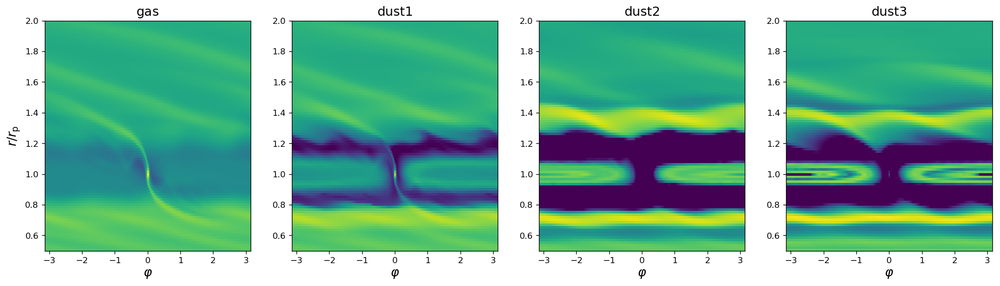

.. _ref_multifluid:

Multifluid
==========

.. note::
   
   This extension is described and tested in `Benítez-Llambay et al. (2019) <https://ui.adsabs.harvard.edu/abs/2019ApJS..241...25B/abstract>`_

.. warning:: Setups from versions < 2.0 are not fully compatible with
	     this version.  However, we provide the script
	     ``scripts/single2multi.py`` that makes old setups compatible
	     with the multifluid requirements (see :ref:`ref_single2multi`).

Notes about the multifluid implementation:

* The new velocities are obtained using an implicit update.

* The implicit update is obtained by solving a set of N linear
  equations. The matrix of this linear system is inverted using
  Gaussian elimination with partial pivoting.

* Dust is treated as a pressureless fluid.

* Different fluids can have different equations of states.

* If a planet is allowed to evolve according to the forces exerted by
  the multifluid system, it evolves according to the gravity produced
  by all the mass of the system (i.e., all the fluids).

.. warning:: If MHD is enabled, multiple species are allowed, but a
             single gas species must be defined.
	     
In this version, the ``fargo_multifluid`` setup is included. This is a
version of the fargo setup with three species of pressureless dust
fluids, interacting with the gas by mean of a drag force parametrized
by a constant Stokes Number.

First run::
  
   $: make SETUP=fargo_multifluid
   $: ./fargo3d setups/fargo_multifluid/fargo_multifluid.par

As an example, we show a snapshot of this setup after 50 orbits.

   The density of each fluid is shown using a log10 color scale from -6 to -3.
   
Setups
------

Since version 2.0, any setup is a multifluid setup. For example, the
original ``fargo`` setup is treated as a multifluid setup where the
number of fluids is equal to one.

Multifluid setups are almost identical to the old setups. The differences are:

* Three mandatory lines must be added to the ``.opt`` file. 
* The fluids must be created before filling the fields.
* If the fluids interact between them, these interactions need to be defined.
* Boundary conditions must be declared for each fluid.

A new set of rules have been designed to simplify the creation of
multifluid setups. Below we explain how to create a multifluid setup.

New rules for the .opt file
----------------------------

Two new variables are mandatory to set the number of fluids.  These
are ``NFLUIDS`` and ``FLUIDS``. The latter must be passed via the
variable ``FARGO_OPT`` to the makefile, like any normal
option. ``NFLUIDS`` sets the total number of fluids and ``FLUIDS``
defines the indices for the fluids. For example, if the number of
fluids is 2, the ``.opt`` file must have the block::

    FLUIDS := 0 1
    NFLUIDS = 2
    FARGO_OPT += -DNFLUIDS=${NFLUIDS}

(do not forget the ``:`` after ``FLUIDS``). 

Creation of new fluids
----------------------

New fluids must be created before filling the hydrodynamic fields in
``condinit.c``. The following function has been developed to simplify
the process:

* ``Fluid* CreateFluid(char* fluidname , int fluidtype)``: This
  function must be used to create new fluids. The ``fluidname``
  argument is the label of the fluid used by I/O routines, and the
  ``fluidtype`` is an integer equal to: ``GAS``, for gaseous fluids
  and any number grater than 1 for dust. We recommend you to use the
  value ``DUST`` in this case.  The value of ``fluidtype`` controls if
  the fluid is subject to viscous forces.

  A global array of size NFLUIDS, ``Fluids[]``, is always available,
  and it should be used in combination with this function. We usually
  use it in ``condinit.c``:

  .. code-block:: c
		
     Fluids[0] = CreateFluid("gas",GAS)
     Fluids[1] = CreateFluid("dust1",DUST)
     .
     .
     .
     Fluids[n] = CreateFluid("dust10",DUST)

  Another variable globally available is the integer
  ``Fluidtype``. This variable changes its value when the function
  ``SelectFluid(n)`` is called, and adopts the value ``fluidtype``
  corresponding to the fluid number ``n``. This variable is useful
  when some part of the code needs to be executed depending on the
  nature of the fluid.

As in the 1.3 version, we work with the same set of primitive fields:
``Density, Vx, Vy, Vz, Energy``, declared as pointers in ``global.h``,
but are not allocated.  In version 2.0, each fluid needs to store its
own primitive fields (each fluid is a structure that contains the
primitive fields) and to recycle all the routines from previous
versions, we need to assign the primitive pointers to the primitive
field of each particular fluid. This process is simplified by the
following function:

* ``void SelecFluid(int index)``: This function allows the user to
  select a specific working fluid.  Let's assume that you have two
  fluids, called ``gas`` and ``dust`` which have been created as::
    
    Fluids[0] = CreateFluid("gas",GAS)
    Fluids[1] = CreateFluid("dust",DUST)
  
  For instance, to initialize the ``Density`` field of the ``gas``
  fluid, call ``SelectFluid()`` before calling the specific
  routine that initializes the density::

    SelectFluid(0)
    InitDensity()

  ``InitDensity()`` is an user defined function which, as in the
  <2.0 version, uses the ``Field* Density`` to refer to
  the density field.

  ``SelectFluid()`` also sets the value of the
  global variable ``Fluidtype``. When ``SelectFluid(i)`` is called,
  ``Fluidtype`` adopts a value ``Fluidtype`` of the fluid ``i``.

Drag force between fluids
-------------------------

The drag force between fluids is applied by the function
``Collisions()``, defined in ``src/collisions.c``. This function uses
the content of ``src/collision_kernel.h``, which builds the matrix
that must be inverted to obtain the implicit update. If you need to
change the drag force (e.g., characterizing the collisions by the
dust-particle size intead of the Stokes number) this is the file that has
to be updated.

To turn on the drag force between different species
requieres a new option in the ``.opt`` file:
   
* ``FARGO_OPT += -DDRAGFORCE`` : Enables the drag force in ``main.c``
  at compilation time.

To fill the collision array, ``Alpha``, and synchronize it with the device (``Alpha_d``),
the function ``ColRate`` was designed:
    
  * ``void ColRate(real value, int i, int j, int feedback)``: Fills
    the entraces ``Alpha[i,j]`` with the collision rate
    (or proportional to it).  By default the element
    ``i,j`` represents the drag force of the fluid j onto the
    fluid i. When ``feedback != 0`` the element ``j,i`` is filled, and
    the back reaction of the fluid ``j`` onto fluid ``i`` is considered. This
    function is usually called in ``CondInit()``.

  .. warning:: ``ColRate()`` copies the collisions matrix ``Alpha``
     from the Host to the Device, with the following instruction:

     ``DevMemcpyH2D(Alpha_d,Alpha,sizeof(real)*NFLUIDS*NFLUIDS);``

     If ``ColRate()`` is not used, the collision matrix must
     synchronized manually.

.. note:: ``std/collision_template.cu`` and not
             ``src/collisions.c`` is compiled when
             ``GPU=1``. However, this file also uses
             ``src/collision_kernel.h``, so you do not need to modify
             it when you change the drag law.

.. _refdiffusion:

Dust diffusion module
---------------------

.. note::
   
   This module is described and tested in the appendix of `Weber et al. (2019) <https://ui.adsabs.harvard.edu/abs/2019arXiv190901661W/abstract>`_.
    
The multifluid feature can be used to simulate dust as pressureless
fluids. For these cases, a new (optional) module is added to account
for dust diffusion.

Diffusion is modelled as a source term in the
continuity equation for (pressureless) dust fluids only, spreading mass
depending on the gradient of the concentration.

The equation

.. math::
   \frac{\partial \rho_{\rm d}}{\partial t} = \nabla\cdot(D\rho_{\rm tot} \nabla C)
   
is solved to first order explicitly. :math:`C = \rho_{\rm d}/\rho_{\rm tot}` is the concentration, with :math:`\rho_{\rm tot} = \rho_{\rm d} + \rho_{\rm g}` and :math:`\rho_{\rm d}, \rho_{\rm g}` being the dust and gas densities, respectively. The diffusion coefficient, :math:`D`, for simplicity is assumed to be equal to the gas turbulent viscosity. This implies a Schmidt-number of :math:`{\rm Sc}=1`.

To turn on the diffusion, in the .opt file add:

* ``FARGO_OPT += -DDUSTDIFFUSION`` : It enables a call to
  ``DustDiffusion_main()`` function in ``main.c``.

.. warning:: Current implementation assumes that the gas is stored in ``Fluids[0]`` and that all additional fluids are pressureless dust fluids of ``Fluidtype=DUST``.
	     
Notes about the dust diffusion implementation:

* The diffusion is applied before the transport step (see
  ``transport.c``) and does not modify the velocities.

* Files related to the dust diffusion module:
  
  - ``dust_diffusion_main.c``: Function that calls the relevant functions of this module.
    
  - ``dust_diffusion_coefficients.c``: Calculates the diffusion coefficient :math:`D` for the activated viscosity module within the mesh. Here, the user can easily modify the dust diffusion model by changing the diffusion coefficients (see warning below).

  - ``dust_diffusion_core.c``: The diffusion equation is solved according to the geometry of the mesh. The output corresponds to the updated density, which is stored in a temporary array. The densities are immediately updated after the loop using ``copy_fields()``.

.. warning::
   If a different diffusion coefficient is implemented, a new time step constraint might be necessary in ``cfl.c``.
    
	     
Boundaries
----------

Each fluid needs a boundary file. For instance, if a fluid of
index ``n=1`` (i.e. ``Fluids[1] = CreateFluid("dust",DUST)``) is
created, the corresponding boundary file ``setup.bound.1`` must be
present in the setup directory. The same is valid for any other fluid
created with a different index ``n``.

.. _ref_single2multi:

Update setups compatible with versions < 2.0
--------------------------------------------

To update a setup from a version < 2.0 go to the directory ``scripts``  and
run the python script ``single2multi.py``, with the name of the setup as argument.
For example, for a setup in ``setups/setupname``

     ``python single2multi.py setupname``

