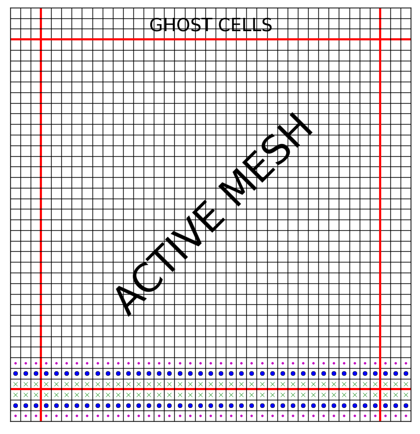

Boundaries
===========

Boundary conditions in FARGO3D can be selected only for the Y and Z
directions, since in X the mesh is always considered periodic.  It is
because FARGO3D was mainly designed for azimuthal-periodic planetary
disks, with a cost-effective orbital advection (aka FARGO)
algorithm. Albeit that this limitation may seem strong  in practice,
there are lots of situations where you can assume your 3D problem to
be periodic along a given direction. *If you can not do that,
unfortunately there is no way to avoid this limitation with the
present version of the code*.

The boundary conditions (BCs) are handled by the script
``boundparser.py``. We have developed a metalanguage to handle
them. Although this may seem quite a futile investment, it soon
appeared to be much needed as we were developing the code. We had
initially left the treatment of BCs on the CPU, even for GPU
builds. We thought that the filling of the ghost zones by the CPU
would have negligible impact on the overall speed of the code. This,
however, turned out to be untrue: the CPU-GPU communication overhead,
and the slowness of CPU calculations lowered the code performance
significantly. We therefore decided to deal with BCs in the exact same
way as with other time consuming routines, which can be translated
automatically to CUDA, so as to run on the GPU. This implied some
syntax constraints on the associated C code, which would have made the
development of a variety of boundary conditions on the four edges of
the mesh a time consuming and error prone process (yes, four, because
they are specified only for Y and Z). For this reason, we have chosen
to write a script that produces the C code for a given set of boundary
conditions, with all the syntactic comments needed to subsequently
translate it to CUDA.

How are boundary conditions applied?
-------------------------------------------------

The boundary conditions are applied just after the initialization of a
specific SETUP (before the first output), and subsequently, twice
per time step. Boundary conditions are applied to all primitive variables,
and to the electromotive forces (EMFs). All  boundary conditions
are managed by the routine ``FillGhosts()``, inside
``src/algogas.c``. Below, we depict schematically how cells of the
active mesh are mapped to the ghost zones.

   Schematic view of how the boundaries are applied. 
   We note that the buffer (or *ghost*) zones are three cells wide.

The last (third) ghost cell is filled with the first active one, the
second ghost cell is filled with the second active one, and finally,
the first ghost cell is filled with the third active cell. 

.. note:: 

   Note that we do not consider the mesh periodicity along a given
   direction as a proper boundary condition, in the sense that no *ad
   hoc* prescription has to be used to fill the corresponding ghost
   zones. Rather, a mesh periodic along a given dimension has no
   boundary in this dimension, and this property is assigned to the
   mesh *in the parameter file* (and not in the boundary files of the
   setup that we present in detail below) by the use of the *Boolean*
   parameters ``PeriodicY`` and ``PeriodicZ``, which default to
   ``NO``. In the boundary files that we present hereafter, you will
   therefore see BC labels such as ``SYMMETRIC``, ``OUTFLOW``, etc.,
   but *never* ``PERIODIC``.

.. note::
   
   In the figure above we have three rows of ghost cells. The number
   of rows depends on the problem, and on how frequently
   communications are performed within a time step. There is a
   trade-off between the number of rows (large buffers slow down the
   calculations and the communications) and the number of
   communications. The number of ghosts is defined in ``src/define.h``
   around line 40 *et sq*.

boundparser.py
--------------

In order to work with boundaries, we have developed a script called
``boundparser.py``, that reads a general boundary text file and converts
it into a C file, properly commented to be subsequently converted into
a CUDA file. ``boundparser.py`` works with four files, called:

* setup.bound
* boundaries.txt
* centering.txt
* boundary_template.c

(note: these last three files can be in your setup directory, or by
default, the script takes those of the  ``std/ directory``, as
prescribed by the ``VPATH`` variable.)

``boundparser.py`` reads the information inside the ``setup.bound``
file, and compares it with the information in ``boundaries.txt`` and
``centering.txt``. Finally, it builds a set of C files that apply the
boundary conditions (called [y/z][min/max]_boundary.c) with a proper
format, given by boundary_template.c. We will not give a detailed
description on how ``boundparser.py`` works, but it is not difficult
to understand the script if you are interested in its details.

The key to developing boundary conditions is to understand the
structure of ``setup.bound`` and ``boundaries.txt`` file. Both files are in
the same format, described below.

Boundaries files format
------------------------

``boundaries.txt``, ``centering.txt`` and ``setup.bound`` files have
the same format. All are case-insensitive, and have two levels of
information: the main level and an inner level. Also, comment lines are
allowed. The general structure of the format is::

    # Some header
    #--------

    LEVEL1_a:
            Level2_a: Some_data1_a   #A comment
            Level2_b: Some_data1_b
            Level2_c: Some_data1_c
            Level2_d: Some_data1_d
    
    # A comment line

    LEVEL1_b:
            Level2_a: Some_data2_a
            Level2_b: Some_data2_b
            Level2_c: Some_data2_c
            Level2_d: Some_data2_d
            

    etc...

centering.txt
-------------

Special care must to be taken to the centering of data. Not all data
are defined at the same location in FARGO3D. In order to write
automatically boundary conditions in a given direction (Y/Z), it is
necessary to know which fields are centered or staggered in this
direction.  This information is taken by ``boundparser.py`` from
``centering.txt``.  This file uses the same format described above,
and uses a particular set of instructions. The allowed values are:

* LEVEL1 --> The name of a Field Structure inside the code (eg:
  Density, Vx, Bz, etc...).
* Level2 --> the word "Staggering"
* data --> C,x,y,z or a combination of xyz (eg: xy, yz, xyz)

C is short of "centered", meaning that the field is a cube-centered
quantity. The meaning of x is *staggered in x*, that is to say the
corresponding quantity is defined at an interface in x between two
zones, rather than in the middle of two subsequent interfaces.  By
default, the field value is assumed centered along each direction that
does not appear explicitly in the centering definition.

Let us have a look at some lines of ``centering.txt``:

           Density:
           	Staggering: C 
           Bz:
           	Staggering: z 
           Emfz:
           	Staggering: xy

The first two lines specify that the density is a cube centered
quantity.  The following two lines specify that the magnetic field in
the z-direction is centered in x and y, but staggered in z (ie defined
at the center of an interface in z).  Finally, the last two lines
indicate that the EMF in z is centered in z, but staggered in x
and y. It is, therefore, a quantity defined at half height of the
lower vertical edge in x and y of a cell.

All primitive variables and the EMF fields are defined by default in
``std/centering.txt``. If you create a new primitive field in the
code, you should specify its correct centering in
``std/centering.txt`` if you want to create boundary conditions for
this field.

boundary_template.c
-------------------

This file is taken as a template for building automatic boundary
condition C files . You should never have to deal with it. Also, it
contains all the information for subsequent building of the CUDA
files. If you need special boundary conditions, you could try
modifying this file first. As long as you do not alter the lines
beginning with "%", you can modify this template. This kind of
modification should be made by an advanced user.

boundaries.txt
--------------

This file is the core file for the boundary condition. The main idea
is to provide a way to the user to define a boundary prescription in
as user-friendly a manner as possible. Let us begin with a simple
example. Assume that we want to define a boundary condition that we
call *SYMMETRIC*, which simply consists in copying the data of the
active cell into the ghost zone. We represent schematically what is
intended on this diagram:

::

  |           |           |
  |           |           |
        ^           ^
        |           |
      ghost       active  
      zone         zone  
 
The active zone contains a value, that we call, arbitrarily, *active*

::

  |           |   active  |
  |           |           |
        ^           ^
        |           |
      ghost       active 
      zone         zone 
 
We want to set the value of the ghost zone to the same value, that is
we want:

::

  |  active   |   active  |
  |           |           |
        ^           ^
        |           |
      ghost       active 
      zone         zone 

Therefore we represent this boundary condition with the following,
rather intuitive line of code:

::

   |  active  |  active  |

Assuming for the moment that this boundary condition applies to
*centered* variables, we would finally write the following piece of code in
``boundaries.txt`` to define our *SYMMETRIC* boundary condition:

::

  SYMMETRIC:
        Centered:    |  active  |  active  |

 
The right "cell" always represent the active cell, and the left "cell"
the corresponding ghost cell.  The string *active* could be actually
any string:

::

  SYMMETRIC:
        Centered:    |  value  |  value  |
 
If we wish to have an anti-symmetric boundary condition (that is to say
that we set the ghost value to the negative of its active
counterpart):

::

  |  -active  |   active  |
 
Should we want to set the ghost value to twice the active zone's
value:

::

  |  2.0*foo  |   foo  |
  
Or if we wish to set it to some predefined value (say that you have
a supersonic flow of uniform, predefined density 0.12 g/cm^3 entering
the mesh, and you work in cgs):

::

  |  0.12  |   whatever  |
  
in which case the value *whatever* is never used. Naturally, it is
much better to use a parameter (say, *RHO0*, that you define in your
parameter file):

::

  |  'RHO0'  |   whatever  |
 
We shall come back to the use of the quotes later on in this section.

This, in a nutshell, is how we define boundary conditions in the code.

Now, assume that we want to have an anti-symmetric boundary condition
on the velocity perpendicular to the boundary. The situation is a bit
different than the one described above, because this field is
staggered along the dimension perpendicular to the mesh. That is, we
have:

::

  |        |||        |
  |        |||        |
            ^       value 
            |
           edge of 
         active mesh 

As shown on this diagram, the value is defined at the interface, and
not at the center as previously. The triple vertical line delineates
the edge of the active mesh. What we intend is the following:

::

       |        |||        |
       |        |||        |
     -value      ^       value 
                 |
                edge of 
              active mesh 
     
but this leaves yet unspecified the value at the edge of the active
mesh, which should be set here to zero (it has to be its own
negative):

::

       |        |||        |
       |        |||        |
     -value      0       value 

Eventually, we have to specify one extra value with respect to the
centered case. Our boundary condition is therefore coded as:

::

  ANTISYMMETRIC:
        Staggered:    |  -value  |  0  |   value  |

If the \| (pipe) symbol could be thought of as representing the zones
interface for the centered case, it is no longer the case in the
staggered case. In any case, we will *always* have two "cells" in the
BC code for a centered quantity, and three "cells" in the BC code for
a staggered quantity, regardless of the number of rows in the
ghosts. The matching between an active cell and its corresponding
ghost zone is as shown on the figure at the beginning of this section.

We sum up this information: the file ``boundaries.txt`` contains a two
level description that obeys the general following rule:

* LEVEL1 --> the name of the boundary. It is an arbitrary name,
  defined by you.
* Level2 --> the word "Centered" or "Staggered", followed by some
  data.
* data --> \|some_text_1|some_text_2| or
  \|some_text_1|some_text2|some_text3|

The rules in the ghost zone are as follows:

1) Any string used in the active zone that matches some part of the
   ghost zone string will be replaced by the active cell value.
2) Any string inside \'\' will be textually parsed and converted to
   upper-case. They are useful to match the parameters of the
   parameter files, which are upper-case C variables.
3) Any string that does not match rule 1 nor rule 2, will be textually
   parsed and converted to lower case.

Additionally, there is a set of indices helpers, for working with boundaries::

*jgh/kgh: The index of the y/z ghost cells.
*jact/kact: The index of the y/z active cells.

These helpers prove very useful to perform complex extrapolations at
the boundaries. You can see examples in the file
``std/boundaries.txt``.

Examples:
.........

**Zero-gradient boundary**:

Suppose we want to define a zero gradient boundary. That means we want
to copy all the active zone in the ghost zone for both centered and
staggered meshes.

The syntax is as follows. It groups together the definitions that we
have worked out above, for centered and staggered fields::

   SYMMETRIC:
   	      Centered:	    |active|active|
   	      Staggered:    |active|active|active|

where the right *active* value will be copied without any modification
to the ghost zone. Note that this boundary definition is direction and
side independent, ie it can apply to *ymin*, *ymax*, *zmin* and
*zmax*.

**Keplerian extrapolation example**

We define here a more complex boundary condition::

   KEPLERIAN2DDENS:
             Centered:            |surfdens*pow(Ymed(jact)/Ymed(jgh),'SIGMASLOPE')|surfdens|

This line is equivalent to::

   KEPLERIAN2DDENS:
             Centered:            |active*pow(ymed(jact)/ymed(jgh),'sigmaslope')|active|

as per the rules listed above.

What kind of action does this instruction correspond to ?
It sets the value of the ghost zone to:

:math:`\mbox{ghost value}=\Sigma_\textrm{active}\left(\frac{R_\textrm{act}}{R_\textrm{ghost}}\right)^\alpha`

since *Ymed* stands for the radius of the center of zone, in  a
cylindrical setup.

The reader familiar with protoplanetary disk's jargon and notation
will easily recognize the radial extrapolation of the surface density
of the disk in the ghost zone, with a power law of exponent
:math:`-\alpha` (:math:`\alpha` is dubbed *SIGMASLOPE* in the
parameters of FARGO3D), hence the string chosen to represent the value
of the active cell (*surfdens*), although at this stage **nothing
specifies yet to which variable this boundary condition should be
applied**. This is the role of the file *SETUP* ``.bound``.

SETUP.bound
-----------

This file must be located in the sub-directory of a given setup, and
must have same prefix as the setup to which it refers. For instance, in
``setup/fargo/``, the file that specifies the boundaries is called
``fargo.bound``. 

The files that we described in the previous paragraphs are used to
specify what transformation rule is used for an arbitrary field (in ``boundaries.txt``)
depending on its centering, while the centering of all fields is
specified by ``std/centering.txt``.

The *SETUP* ``.bound`` file  now specifies the transformation rule to use
*for each physical variable*. It obeys the following general syntax:

* LEVEL1 --> The name of the field.
* Level2 --> The side of the boundary (ymin,ymax,zmin,zmax), and some data.
* data --> Boundary label (the label defined in ``boundaries.txt``)

We show hereafter a few examples:

**2D XY reflecting problem**

We want to have a 2D isothermal fluid with periodic "boundary conditions" in X (as
required in FARGO3D) and reflecting boundary conditions in Y.

We have three primitive variables to which we must apply BCs. Those
will only apply in Y (not in X because of the periodicity, nor in Z
because we have a 2D X-Y setup). 

The setup.bound file should therefore look similar to::

	Density:
		Ymin:   SYMMETRIC
		Ymax:   SYMMETRIC
	
	Vx:
		Ymin:   SYMMETRIC
		Ymax:   SYMMETRIC
	
	Vy:
		Ymin:   ANTISYMMETRIC
		Ymax:   ANTISYMMETRIC

where Vy is ANTISYMMETRIC in Y because we have reflection in  the
y-direction. 

At build time, the script ``boundparser.py`` goes through this
file. The first three lines instruct it to generate C code to implement a
boundary condition for the density field in *ymin* and *ymax*. It goes
to the definition of *SYMMETRIC* found in ``std/boundaries.txt``. Two
definitions are available: one for centered fields, the other one for
staggered fields. In ``std/centering.txt`` it finds that the density
is centered (in y) and therefore generates the C code corresponding to
the centered case. The same thing occurs for *Vx*: it finds that this
field is centered in Y. Finally, the last three lines instruct it to
generate C code for an *ANTISYMMETRIC* boundary condition of Vy
in Y. It finds in ``std/centering.txt``  that this field is staggered
in Y, and generates the C code corresponding to the definition::

  | -value | 0 | value |

The C functions thus produced contain all the comments required to
further conversion to CUDA, should the user request a GPU built.

**2D YZ reflecting problem**

Now, a more complex example, with all directions (yet in 2D)::

	Density:
		Ymin: SYMMETRIC
		Ymax: SYMMETRIC
		Zmin: SYMMETRIC
		Zmax: SYMMETRIC
	
	Vx:
		Ymin:	SYMMETRIC
		Ymax:   SYMMETRIC
		Zmin:   SYMMETRIC
		Zmax:   SYMMETRIC
	
	Vy:
		Ymin:	ANTISYMMETRIC
		Ymax:   ANTISYMMETRIC
		Zmin:   SYMMETRIC
		Zmax:   SYMMETRIC
	
	Vz:
		Ymin:	SYMMETRIC
		Ymax:   SYMMETRIC
		Zmin:	ANTISYMMETRIC
		Zmax:   ANTISYMMETRIC

.. note::
   Note how the staggering is implicit in Vy/Vz boundaries. 
   
An extensive list of examples can be found in the ``setups/`` directory.

Common errors
-------------

This section will be developed later from users' feedback. 

The ``boundparser.py`` script is at the present time a bit taciturn,
and may silently ignore errors which might be a bit difficult to spot
afterward.  Among them:

* Incorrect names or misprints.
* An incorrect centering.

Shearing-periodic boundaries
----------------------------

Shearing box setups can make use of shearing-periodic boundaries by by using ``-DSHEARINGBC`` in the ``.opt`` file.

.. warning::
	shearing-periodic boundaries only work on the CPU.

.. _ref_hardboundaries:

Defining boundaries by hand
-----------------------------

Sometimes more flexibility is needed when creating boundaries. You can
always define the boundaries by hand by disabling the parser that
creates the boundaries.

In order to create the boundary sources manually, you can proceed as follows:

1. Create the ``ymin_bound.c``, ``ymax_bound.c``, etc... files manually::

     > cd scripts
     > python boundparser.py ../std/centering.txt ../std/boundaries.txt ../setups/yoursetup/yoursetup.bound

The previous instruction produces the boundary files (in ``scripts/``) called ``ymin_bound.c``, ``ymax_bound.c``, etc..., needed to build the executable.

2. Copy the newly created boundary source files into your setup directory.

3. Comment the following lines in the makefile::

     %_bound.o: ymin_bound.c ${GLOBAL}
     	@${COMPILER} $*_bound.c -c ${INCLUDE} ${OPTIONS} ${FARGO_OPT}
     
     ymin_bound.c: ${BOUNDARIES} ${GLOBAL}
     	@echo PARSING BOUNDARIES...
     	@-python ${SCRIPTSDIR}/boundparser.py $^
     
     ymax_bound.c zmin_bound.c zmax_bound.c: ymin_bound.c

4. Modify the boundary source files manually.

5. build the executable (``make``) and check if the boundaries were indeed compiled from your setup directory, e.g::

     ...
     CC ../setups/fargo/ymin_bound.c ==> ymin_bound.o
     CC ../setups/fargo/ymax_bound.c ==> ymax_bound.o
     CC ../setups/fargo/zmin_bound.c ==> zmin_bound.o
     CC ../setups/fargo/zmax_bound.c ==> zmax_bound.o
     ...

.. note::

   Since the version 2.0, the ``.opt`` option ``FARGO_OPT += -DHARDBOUNDARIES`` has been added to make the steps 3,4 and 5 automatically.
     
