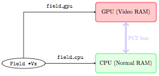
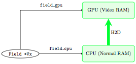
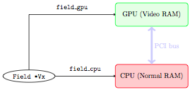
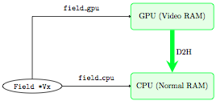
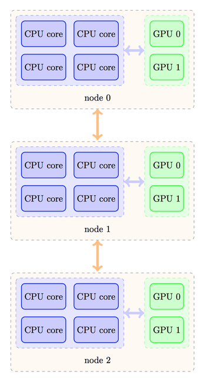
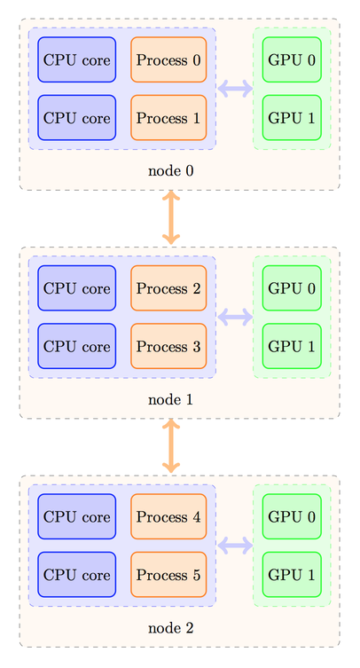
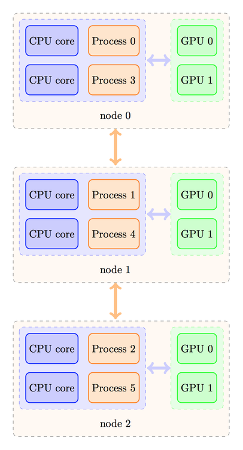

Communications
===============

Mono-GPU runs (with CUDA, multi-CPU runs (with MPI) and obviously
multi-GPU runs (with MPI+CUDA) all need some kind of communications.

When we run a SETUP on a GPU, the GPU sometimes needs to exchange
information with the host (CPU). It is therefore important to give
some information about this kind of transactions.

On the other hand, when we run a CPU-parallel version of the code,
each processor must communicate information about its contour cells
with neighboring processors, which involves MPI communications.

Finally, when we run a mixed version (ie: GPU-parallel, on a cluster
of GPUs), both processes are combined, and communications

   device<--->host (CPU) 

happen, as well as communications:

  CPU<---through MPI--->CPU

Traditionally, GPU to GPU communication would imply a three-part trip:
the information is downloaded from the GPU to its corresponding CPU
(process), then sent to a neighbor, and finally uploaded to the GPU of
that neighbor.

Recent CUDA implementations permit however to issue MPI communication
statements using pointers on board the GPUs. The information then
travels using the fastest way, in a manner totally transparent to the
user. FARGO3D handles this case, which is activated with the make
option "mpicuda" (``make mpicuda`` or ``make MPICUDA=1``). If you want
to get the best performance of FARGO3D on your GPU cluster, it is
mandatory to use the ``mpicuda`` option.

We present in some detail all these kinds of communications hereafter.

.. _gpucomm:

GPU/CPU communications
-----------------------------------------

First to all, assume we run the code in sequential mode on one GPU.
Naturally, routines that run on the GPU must have at their disposal
data in the Video RAM (device's global memory in GPU's jargon),
whereas routines that run on the CPU must have at their disposal data
on the normal RAM (host memory). When the data is updated on, say, the
GPU, it is not updated automatically on the CPU, nor vice-versa.

Managing manually data transfer between CPU and GPU (host and device)
is a programmer's nightmare. It is extremely error-prone, and proves
to be impractical for a code of the complexity of FARGO3D. The GFARGO
code, which has a simpler structure, has been developed using manual
data transfers from GPU to CPU and vice-versa, and it took a very long
time to get the data transfers right.

In order to understand how data transfer is dealt with in a
semi-automatic way in FARGO3D, let us examine a real-life example. In
what follows, a green rectangle means that the data is correct and up
to date, whereas a red rectangle corresponds to random or out-of-date
data.

We start by initializing a data field (say ``Vx``), on the CPU (there
is absolutely no reason to try and initialize them directly on the
GPU: this would add a lot of complexity and it would be pointless).

We have therefore the following situation:

Before starting a (M)HD time step on the GPU, we need to upload the
data to it. This is done by a "host to device" communication (``H2D``)
which occurs through the PCI bus:
		    

The run can start on the GPU. Only the data on board the GPU is then
up to date, while the data on the CPU is left untouched and
corresponds to the initial condition:
		    

At some point, we need to get the data back on the CPU (for instance
to dump it to an output file, or because we have written a new routine
that uses it and which we have not developed to run on the GPU). We
need to perform a communication through the PCI bus from the device to
the host (``D2H``), this time:
		    

		    
A simple example could be:

Suppose we are in the first time step of a run, and we want to compute
the pressure field on the GPU (:math:`P=c_s^2\rho`), but we have set
the initial conditions on the CPU. We need to upload the sound speed
and density fields. We do not upload all fields. This would be
extremely time-consuming. We only upload what is needed and nothing
else.
 
In order for that to be achieved semi-automatically, we have defined
two macrocommands that are called ``INPUT`` and ``OUTPUT``. What these
macrocommands do is that they update the "color" (red or green) of a
field on the GPU or CPU, so that we know whether it is up to date or
not, and they transfer the data to the place where the calculation is
going to proceed, if it turns out to be out of date at the beginning
of a routine. For instance, consider the following piece of code::

  ComputePressure () {
      INPUT (SoundSpeed);
      INPUT (Density);
      OUTPUT (Pressure);
      ....
      main loop:
             pressure[l] = density[l]*soundspeed[l]*soundspeed[l];
   }

The macrocommands ``INPUT`` and ``OUTPUT`` expand differently on the
CPU and on the GPU (to be more accurate in C functions and in CUDA
kernels).  On the CPU, ``INPUT`` checks the "color" (red or green) of
its argument field on the CPU, and if it is red, it requires a
communication "device to host" of this specific field. This ensures
automatically that the field we process on the CPU is up to date when
we enter the routine's main loop.  Similarly, on the CPU, ``OUTPUT``
sets to "green" the state of its argument field on the CPU, and to
"red" its state on the GPU.

On the GPU, the macrocommands expand in the opposite way. We leave as
an exercise to the reader to check that one can exchange in the above
paragraph the words CPU and GPU, device and host.

.. note:: Implementation-wise, we do not truly define a color for CPU
   and GPU. Rather, each Field has two boolean flags, named
   ``fresh_cpu`` and ``fresh_gpu``. If ``fresh_cpu`` is YES, it means
   that the data on the CPU is up to date ("green state" in the above
   explanation), and out of date otherwise ("red state"). Similar
   rules apply for ``fresh_gpu``.  One should never set, nor even see
   directly these flags. All of this is taken care of by ``INPUT`` and
   ``OUTPUT``.

**Take away message**: you should only care to properly state, at the
 beginning of each routine, which fields are ``INPUT`` and which
 fields are ``OUTPUT``. That's all.  This should be done rigorously as
 you start to write the routine. If you forget to do it, the code will
 throw wrong results when run on a GPU built.  If you do it correctly,
 you will never have to worry about CPU/GPU communications, which will
 take place automatically for you behind the scene. This is easy to
 do, intuitive, but it must be done rigorously.

All the details can be found in ``src/fresh.c`` file. We have actually
developed several kinds of ``INPUT/OUTPUT`` macrocommands, for each
type of field encountered in the code: Field (volumic data), Field2D
(X-averaged, ie azimuthally averaged data 2D real data), and
FieldInt2D (2D fields of integers). The latter is used in particular
for the shifts needed by the azimuthal advection::
  
  INPUT(Field)
  INPUT2D(Field2D)
  INPUT2DINT(FieldInt2D)
  OUTPUT(Field)
  OUTPUT2D(Field2D)
  OUTPUT2DINT(FieldInt2D)

Under the hood, these methods are only wrappers of the cudaMemcpy()
function.

MPI
---

When FARGO3D is running in parallel mode, the main computational mesh
must be split into several submeshes, each one corresponding to a
cluster core. All the computation is done independently inside this
submesh (because all the HD/MHD equations are local), but at the
borders of the submeshes some communications must be done with
neighbors in order to merge all problems into a big one.

The mesh is split so as to minimize the surface of contact between the
processors. Following this rule, the size of the communications is
minimal. Note that much like the former FARGO code, the mesh is not
split in the X (azimuthal) direction, because orbital advection is not
local in x. This represents a penalty for communications, because the
"contact surface" between processors is not as small as it could be if
we split the mesh in x as well.

The abscissa and ordinate of each processor in the 2D mesh (Y and Z)
of processors are the global variables ``I`` and ``J``. In practice,
with this indices, and with the variables CPU_Rank and CPU_Number, you
have all the information needed to know where each process lies in the
mesh of processes and who the neighbors are.

MPI-CUDA
--------------

General considerations
.........................................

In a mixed CUDA+MPI run, we must have one processing element
("processor") per GPU. Normally, when you run CUDA on one GPU only,
the driver selects the device for you automatically, or you may
specify manually which device you want to run on by specifying the
``-D`` flag on the command line.  This is obviously not possible here,
as all processes within the same node would run on the same
device. Instead, each process will have to select at run-time, in an
automatic manner, the correct GPU through a directive of the kind::

  cudaSetDevice (int device_number);

where ``device_number`` must be evaluated depending on the process
rank.  Assume that your cluster has a topology similar to this one:

  
  *Three nodes interconnected by a fast network, with 4 CPU cores and
   2 GPUs each.*

Despite the fact that four processes could fit on each node for
non-GPU runs, here we must limit ourselves to two processes only per
node, otherwise, several processes will use the same GPU, leading to a
degradation of performance. Depending on your MPI implementation, the
rank ordering of processes could then be as follows:

 
  *The process ranks increases within a node, then from node to
   node. A node is filled with processes until it is full, then MPI
   continues with the following node*

or the processes could be distributed in a different manner, as shown
below:

  *The processes are distributed in a Round Robin fashion: process 0
   to node 0, process 1 to node 1, etc. and MPI returns to node0 once
   the available number of nodes has been reached*

The strategy to calculate the device number would be different in
these two cases.  In the first case, we should have a rule like this
one::

  device_number = CPU_Rank % number_of_processes_per_node;

where the ``%`` operator represents the *modulo* operation in C. On
the contrary, in the second case, we would need a rule like this one::

  device_number = CPU_Rank / number_of_nodes;

where the division is an integer (Euclidean) division.

Naturally, in the first case, the ``number_of_processes_per_node`` is
also the number of GPUs per node. We can check that it yields the
desired correspondence:

.. table::

   ==========  =====
     Process    GPU 
   ==========  =====
     0          0 
     1          1 
     2          0 
     3          1 
     4          0 
     5          1 
   ==========  =====

 
whereas in the second case the correspondence is as expected:

.. table::

   ==========  =====
     Process    GPU 
   ==========  =====
     0          0 
     1          0
     2          0 
     3          1 
     4          1 
     5          1 
   ==========  =====

Prior to writing the rule to select your GPUs on your cluster, you
should determine how your MPI implementation distributes the process
ranks among the nodes (case 1 or 2) by writing a test program such
as::

   #include <stdio.h>
   #include <mpi.h>
   
   int main (int argc, char *argv[]) {
     int rank;
     char hostname[1024];
     MPI_Init (&argc, &argv);
     MPI_Comm_rank (MPI_COMM_WORLD, &rank);
     gethostname (hostname);
     printf ("I, process of rank %d, run on host %s\n", rank, hostname)
     MPI_Finalize();
   }

Implementation of the device selection rule
.........................................................................

How do we implement the device selection rule seen above? This should
be done on a platform+MPI version basis (on the same platform, two
different flavors of MPI may behave differently). This is done in the
function ``SelectDevice (int myrank)`` in the file
``src/select_device.c``.  You can see that in this function we have a
series of tests on the hostname for which we have implemented some
selection rules. For instance, we have developed FARGO3D among others
on a workstation with two Tesla C2050 cards (hostname ``tesla``), and
for this device, we have the selection rule::
  
  device - 1-(myrank % 2);

which selects device 1 for rank 0 and device 0 for rank 1 (the reason
for swapping the GPUs with respect to normal order is that a run with
1 process only will run on the GPU 1, for which the temperature levels
off at a smaller value than GPU 0 during a long run...).

As you see, you have all the freedom to implement your own rules
within this routine, with tests similar to those already written. It
would be probably better to have tests using an environment variable
or to use ``#ifdef`` directives which would use some variable defined
in the platform specific section of the makefile. We might implement
such features in the future.

The device eventually adopted by the process is as follows:

* If an explicit rule is defined for your platform, the device defined
  in this rule is adopted.

* If you specify explicitly the device with the ``-D`` option on the
  command line, the device thus chosen has priority in any case (in
  particular it overwrites the device given by your platform rule, if
  any).

.. note:: If your run is MPI and you use option ``-D``, a warning is
          issued since all your processes run on the same GPU.

* If no rule is found for your platform and you have not specified any
  device on the command line, CUDA chooses the device for you (the
  rules for this selection are those of the function
  ``cudaChooseDevice()``.)  DO NOT RELY ON THIS AUTOMATIC SOLUTION to
  decide for you in a MPI run. The different processes will see that
  device 0 is available when they enter simultaneously the function
  ``select_device()`` and they will all select this device.

Finally, a message is issued in any case stating the process rank and
the device on which it runs.

.. _mpicuda:

CUDA aware MPI implementations
...............................................................

As advertised earlier, recent implementations of CUDA can deal with
direct device-to-device ("GPU to GPU") MPI communications (so-called
GPU Direct). We shall not consider the details here but the interested
reader could consult the following page_.

.. _page: http://devblogs.nvidia.com/parallelforall/introduction-cuda-aware-mpi/

Compiling the code with a CUDA aware version of MPI is relatively
straightforward, but there is one subtlety with which we must
deal. The problem is the following.

In order to setup the CUDA-aware MPI machinery behind the scene, each
process must already have "chosen" its GPU when the code executes
``MPI_Init()``. However, as we have seen at length above, choosing the
GPU is done on the basis of the rank. But how can a process know its
rank, even before entering ``MPI_Init()`` ?  In order to avoid this
vicious circle, implementations of MPI provide a mechanism that allows
us to know the rank of the process even before ``MPI_Init()`` has been
invoked. This mechanism cannot be a ``MPI_Something ()`` directive, as
no MPI directive can be called before ``MPI_Init()``. Rather, it
simply consists in reading an environment variable that has a specific
name. There are two such flavors of variables in each MPI
implementation/ For instance, these variables are named
OMPI_COMM_WORLD_RANK and OMPI_COMM_WORLD_LOCAL_RANK in OpenMPI. Each
process can, therefore, get its rank in this manner::

  rank = atoi(getenv("OMPI_COMM_WORLD_RANK"));

or its local rank (i.e. within a given node) as follows::

  local_rank = atoi(getenv("OMPI_COMM_WORLD_LOCAL_RANK"));

The value returned will be different for each process, which will
allow a selection of the device on this basis, so that ``MPI_Init()``
can be called afterwards. If FARGO3D is compiled with the make flag
MPICUDA, main() will invoke a function called
``EarlyDeviceSelection()`` just after reading the parameter file, and
it will subsequently invoke ``SelectDevice()`` with the rank thus
obtained.

.. note:: Using ``OMPI_COMM_WORLD_LOCAL_RANK`` instead of
          ``OMPI_COMM_WORLD_RANK`` is simpler. The former returns the
          rank within a node (hence its name), so that it can directly
          select the device number ``local_rank`` without further
          arithmetic. This is the approach used in FARGO3D when the
          build flag ``MPICUDA`` is set.

To sum up, if you want to build FARGO3D with a CUDA aware MPI
implementation, you must pass this special environment variable to the
code at build time. This is achieved by defining the variable ENVRANK
in the makefile. You should edit one of the platform specific build
options provided in the makefile and adapt it to your own needs.

.. note:: how do you know if the code is really running with GPU
          Direct ? At run-time on a GPU built, if any communication of
          a data cube occurs between the CPU and GPU, a flag is
          raised, and a "!" is printed on the terminal instead of
          FARGO(3D)'s classic dot. This helps to diagnose that
          something is wrong, for instance when a part of a time step
          is still running on the CPU (expensive, "volumic" kind of
          data transfer are therefore occurring at each time
          step). Similarly, if any communication of a data "square"
          (ie the boundary of a cube) occurs between the CPU and GPU,
          another flag is raised, and a ":" is printed on the
          terminal. This happens if MPI communications are done
          through the host, instead of being achieved through GPU
          Direct: "surfacic" kind of data transfer is necessary
          between the host and the device in this case.

To sum up, if you see on the terminal a line such as::

 !!!!!!!!!!!!!!!!!!

some part of the time step is still running on the CPU, with a
dramatic impact on performance. If you see::

 :::::::::::::::::

then all routines are running on the GPU but MPI communications are
still done through the host, with a sizable performance
penalty. Finally, when you see the customary line of dots, everything
is running on the GPU and MPI communications are achieved through GPU
direct.

Spawning a job on a cluster of GPUs: a primer
---------------------------------------------------------------------------------------

* If ``MPICUDA`` is not defined:

  * You can use the flag ``-D`` to specify the device number on which
     each GPU job must be launched. This is fine if your cluster has
     only one GPU per node and you spawn one PE per node. A warning
     message is issued in any case, as specifying manually the device
     number should be reserved for sequential runs.

  * Alternatively, you can define a rule (e.g. hostname based) for the
    device number, on the model of those already written in
    ``src/select_device.c`` in the function ``SelectDevice()``, which
    is the function called when the code is compiled without
    ``MPICUDA``.

* if ``MPICUDA`` is defined:

   * You can use the flag ``-D`` to specify the device number on which
      each GPU job must be launched. This is fine if your cluster has
      only one GPU per node and you spawn one PE per node. A warning
      message is issued in any case, as specifying manually the device
      number should be reserved for sequential runs.

   * You can use the flag ``+D`` to specify a list of devices on each
     host. This is meant to be used, in general, with a job scheduler
     such as PBS (see :ref:`execflags`.)

   * Finally, when neither ``+D`` nor ``-D`` is used, the device are
     selected on the base of the local rank. All GPUs on the nodes
     used by the run should be free when the run is launched,
     otherwise they may get oversubscribed.
  
.. note:: The ``+D`` flag does not work for a build without
          ``MPICUDA`` (non CUDA aware build).
  
