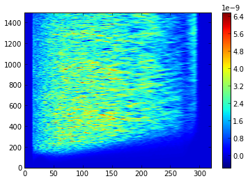

Default SETUPS
==============

FARGO3D was developed with simulations of protoplanetary disks in mind
but it is a sufficiently general code to tackle a lot of different
problems. This property makes that its ancestor, the public code FARGO,
is simply a particular case of the wide range of possible setups
that can be designed.

This section contains a brief summary of the setups that come with
the public version of FARGO3D. We develop in more detail the
setup called ``fargo``.

We emphasize that a setup must not be confused with a set of
parameters, those being provided in a so-called parameter files (with
extension ``.par``, by convention). A setup corresponds to a given
physical problem and geometry: in a setup we specify the grid
geometry, the equation of state to be used, whether we use the MHD
module. etc. In the parameter file we give specific values for a given
setup, such as the mesh size, parameters specific of the initial
conditions, etc. A given setup can be run with many different
parameter files without recompiling. Usually one file only is required
to run FARGO3D once it has been build for a given setup. This file is
the parameter file. There is an exception with some setups, like the
``fargo`` setup, which in addition require a file in which the
planetary system initial configuration is specified. The planet files
(which by convention have the extension ``.cfg``) have the exact same syntax
as in the former FARGO code, so planetary systems designed for a prior FARGO
calculation can be used straight away. There are located in the
sub-directory ``planets`` of the main directory. Their name and path
must be passed to the code through the string parameter ``PLANETCONFIG``.

.. _ref_setupfargo:

fargo
-----

This setup is a legacy setup. The public FARGO code, ancestor of
FARGO3D, amounts to this particular setup of FARGO3D. This is the
default setup, and the initial conditions are taken from one of the EU
comparison setups. The setup is strictly comparable to the template.par
parameter file of the FARGO code.

We explain some special characteristics of the fargo setup:

Make options
............

This setup uses the following physical options, which are selected in
the file ``setups/fargo/fargo.opt``:

* X
* Y
* CYLINDRICAL
* ISOTHERMAL
* VISCOSITY
* POTENTIAL
* STOCKHOLM 

It also activates the following flag:

* LEGACY

which requests the output of two files dumped by the former FARGO
code: ``dims.dat`` and ``used_rad.dat``, which can be needed by
certain reduction scripts.

As can be seen also in the .opt file, it has the monitoring of the:

* MASS
* MOM_X
* TORQ

We shall come back to the *monitoring* of quantities later on in this
manual

Parameters
..........
The following parameters are essentially the same as those of the
FARGO code. You can also browse the online help of that code to get
the detail of each of them.

* **Setup**: This keyword specifies the name of the setup that should
  be used to build the code in order to run this parameter file. If it
  is left unspecified, this parameter file can be run using a build of
  FARGO3D with ``otvortex``, ``mri``, etc., with potentially
  surprising error message and outcomes.

* **AspectRatio**: (real). Sets the disk aspect ratio (:math:`h_0 =
  H/R_0`) at :math:`r=R_0`, where :math:`R_0` is a characteristic
  length, defined in `src/fondam.h`. It is a natural choice to use
  :math:`R_0=1` in a scale free setup. Physically, this parameter is
  related to the sound speed through:

       .. math::
	  \displaystyle{\frac{H}{r} = \frac{c_s}{\Omega_k r}}

  This parameter is a way to initialize a desired sound speed on the disk. 

* **Sigma0**: (real) Sets the numerical value of the surface density at :math:`r=R0`.

* **SigmaSlope**: (real) Sets the exponent of the density profile,
  assumed to be a power law of radius:

.. math::
   \displaystyle{\Sigma(r) = \text{Sigma0}\left(\frac{r}{R_0}\right)^{\text{-SigmaSlope}}}

* **FlaringIndex** (real) Sets the flaring of the disk. If it is null, the aspect ratio of the disk is constant (ie, the disk height scales linearly with *r*). The dependence of the the aspect ratio with the flaring index is:

.. math::
   \displaystyle{h(r) = \frac{H}{r} = h_0\left(\frac{r}{R_0}\right)^{\text{FlaringIndex}}=\text{AspectRatio} \left(\frac{r}{R_0}\right)^{\text{FlaringIndex}}}

* **PlanetConfig**: (string) The name the planetary file to be used. The
  path is relative to the location at which you launch the code.

* **ThicknessSmoothing**: (real) Potential smoothing length for all
  the planets. The use of this parameter is mutually exclusive with
  the use of ***RocheSmoothing***. The smoothing length :math:`s` of the potential is ":math:`\text{ThicknessSmoothing} \times H`":

.. math::
   \displaystyle{s  = \text{AspectRatio} \times
   \left(\frac{r}{R_0}\right)^{\text{FlaringIndex}}\times r \times \text{ThicknessSmoothing}}

   \text{The potential of a planet of mass $m_p$ has the form:  }
   \displaystyle{\phi = -\frac{Gm_p}{\sqrt{r^2+s^2}}, \text{where $r$
   is here the distance to the planet.}}

* **RocheSmoothing**: (real) Potential smoothing length for all the
  planets. The use of this parameter is mutually exclusive with the
  use of ThicknessSmoothing. The smoothing length of the potential
  over the mesh is ":math:`\text{RocheSmoothing} \times R_h`", there
  :math:`R_h` is the Hill radius of the current planet:

.. math::

   \displaystyle{s  = \text{RocheSmoothing}\times r\times \left(\frac{m_p}{3M_{star}}\right)^{1/3}}

* **Eccentricity**: (real) The initial eccentricity of all the planets.

* **ExcludeHill**: (boolean) When this parameter is set to YES, a
  cut-off is introduced when the force is computed. The cut-off is calculated with the formula:

     .. math::

	h_c = 0 \;\;\;\text{ if } r/r_{Hill} < 0.5
     
	h_c = 1 \;\;\;\text{ if } r/r_{Hill} > 1.0
  
	h_c = \sin^2\left[\pi \left(r/r_h - 1/2 \right)\right] \;\;\;\text{ otherwise }
   
   and the force is cut off prior to the torque calculation (see src/compute_force.c):

        .. math::

	   F_{\text{cut off}} = F \times h_c

.. note:: 
   This parameter needs the make option called HILLCUT
   to be activated in the .opt file (it is because this cut is somehow
   expensive on the GPU). This is achieved by adding this line to
   the ``setups/fargo/fargo.opt`` file: **FARGO_OPT += -DHILLCUT**

**IndirectTerm**: (boolean) Selects if the calculation of the
potential indirect term that arises from the primary acceleration due
to the planets' (and possibly the disk's) gravity is performed. In the
``fargo`` setup, the reference frame is by default centered on the
central star (see also :ref:`ref_nodefaultstar`).  For this reason,
this parameter should normally be set to ``yes``.  If the preprocessor
macro ``GASINDIRECTTERM`` is undefined, the indirect term only arises
from the planet's acceleration imparted to the primary. If, on the
contrary, this macro is defined, the acceleration imparted to the
primary by the disk is also taken into account. Defining this macro
can be done in the ``.opt`` file using the line: **FARGO_OPT +=
-DGASINDIRECTTERM**.

**Frame**: (string) Sets the reference frame behavior: F (Fixed), C
(Corotating) and G (Guiding center) (it is case insensitive). When it
is set to F, the frame rotates at a constant angular speed, specified
by **OmegaFrame**. When it is set to Corotating, the frame corotates
with planet number 0. If this planet migrates or has an eccentric
orbit, the frame angular speed is not constant in time. When it is set
to Guiding-Center, the frame corotates with the guiding-center of
planet 0. The frame angular speed, therefore, varies with time if the planet
0 migrates, and it does so in a smoother manner than in the Corotating
case.

**OmegaFrame**: (real) It is the angular velocity of the reference frame. It has sense only if the parameter **Frame** is equal to F (Fixed).

.. All the other parameters are set to the default value on the code and are explained in the section "Parameters". 

boundaries
...........

Because this problem is 2D in XY, only boundary conditions in Y are
applied. The boundary conditions are an extrapolation of the Keplerian
profile for the azimuthal velocity, the density is also extrapolated
using its initial power law profile, and an antisymmetric boundary
condition on the radial velocity is applied.

If ``STOCKHOLM`` is activated (in the ``.opt`` file), the wave-killing
recipe of De Val-Borro (2006) is used to damp disturbances near the
mesh boundaries in radius (or colatitude for more general setups such
as ``p3diso``).  The width of the margin over which a wave killing
boundary condition is applied near a boundary is defined by the
parameters ``DampingZone`` for the radial boundaries and
``KillingBCColatitude`` for the boundaries in colatitude.  The former
represents the ratio of the orbital periods between the edge of the
wave-killing zone and the corresponding edge of the mesh. The default
value of 1.15 implies that the wave-killing zones have a width
approximately equal to 10% of the radius of the mesh edge
(:math:`1.15^{2/3}\approx 1.10`).  ``KillingBCColatitude`` represents
the fraction of the angle between the mesh limit and the midplane over
which the damping prescription is applied. It defaults to 0.2. You can
use a value smaller than one for ``DampingZone`` to suppress the
wave-killing boundary condition at radial boundaries, and you can use
a negative value for ``KillingBCColatitude`` to suppress this
prescription in the boundary in colatitude.

In Cylindrical setups, no damping is applied in the Z-boundary if the
setup is periodic along that direction (such as in unstratified MRI),
and a 10% margin is applied otherwise. This is hardcoded in
``src/stockholm.c``.

.. note:: It is not recommended to use a wave-killing boundary
	  condition in colatitude when a gap-opening planet is present
	  in the disk: replenishing the  gas at high altitude tends to
	  prevent the opening of the gap. At the very least, if a
	  wave-killing boundary condition is used in this case, it
	  should not be applied on the density (the corresponding line
	  should be commented out in ``src/stockholm.c``).

.. note:: the default value of 1.15 for `DampingZone` is smaller than
	  the recommended value of 1.5 found by Benitez-Llambay et al. (2016,
	  ApJ,  826, 13). Using this value would require much larger
	  radial ranges for the meshes of the public setups provided
	  in the distribution. As a consequence, a minute amount of
	  wave reflection may be noticed with these setups even when
	  the wave-killing prescription is activated.

..
   Initial condition NO ESTOY CONVENCIDO QUE LO SIGUIENTE SEA
   NECESARIO. ES EN PARTE REDUNDANTE CON LO ANTERIOR.
   .................
   
   The **density** is:
   
   .. math::
   
      \displaystyle{\Sigma(r) = \Sigma_0 \left(\frac{r}{r_0}\right)^{-\sigma}}
   
   where :math:`\sigma` is the SigmaSlope parameter.
   
   The **sound speed** is:
   
   .. math::
     
      \displaystyle{c_s(r) = v_k(r)h_0 \left(\frac{r}{r_0}\right)^{f}}
   
   where :math:`v_k(r)` is the Keplerian velocity at :math:`r`. :math:`f` is the flaring index.
   
   The radial velocity is zero, and the azimuthal velocity is:
   
   .. math::
   
      v_{\varphi} = v_k \left[1+h^2(r)\left(2f-\sigma-1\right) \right]^{1/2}
   
   
   If ADIABATIC is activated, the sound speed turns into the **internal energy**:
   
   .. math::
   
      \displaystyle{e = \frac{c_s^2}{\gamma-1}\rho}
   
   where :math:`c_s` is the same as before.
   
.. Blob
   ----

Orszag-Tang Vortex
------------------------------

This setup corresponds to the well known 2D periodic MHD setup of
Orszag and Tang, widely used to assess the properties of MHD solvers.
We briefly go through the make options of the .opt file and through
the parameter file.

Make options
............
Here are the options activated in the .opt file:

* X
* Y
* Z
* MHD
* STRICTSYM
* ADIABATIC
* CARTESIAN
* STANDARD
* VANLEER

The first four lines are self-explanatory.

.. note::
   Even though the Orszag-Tang setup is a 2D setup,  every time the MHD
   is included, all three dimensions should be defined. This is why
   we define here X, Y, and Z.

The flag **STRICTSYM** on the fifth line is meant to enforce a strict
central symmetry of the scheme. Usually, after some time (the amount
of time depends on the resolution) the central vortex begins to drift
in some direction, breaking the initial central symmetry of the
setup. It can be desirable to check whether this break of symmetry
arises as a consequence of amplification of noise, or because the
scheme contains a bug that renders it non-symmetric. We have found
that, at least on the CPU, asymmetries in the scheme arise from
additions of more than two terms, which are non-commutative. As the
MHD solver implies, at several places, arithmetic averages of four
variables, we need to group them by two in order to enforce
symmetry. If the initial conditions are strictly symmetric, the fields
will then remain symmetric forever. The interested reader may "grep"
STRICTSYM in the sources. This trick does not work on the GPUs on
which we have tested it, however.

The other make flags have already been discussed in the ``fargo``
setup.

Parameters
.......................
The parameter file is short and each of its variables is
self-explanatory.

Suggested run
..............................

You may activate run time visualization to see the vortex evolve (you
must have installed ``matplotlib`` for that)::

  $ make SETUP=otvortex GPU=0 PARALLEL=1 view
  $ mpirun -np 4 ./fargo3d setups/otvortex/otvortex.par

.. Kelvin-Helmholtz
   -----------------

Sod shock tube 1D
-----------------
This very simple setup is self-explanatory. You may obtain information
about it by issuing at the command line::

  make describe SETUP=sod1d

If you build it with run-time visualization, a graph of a field is
displayed in a matplotlib window. This field is selected by the
variable **Field** of the parameter file.

.. Sod shock tube 2D
   -----------------

.. Brio & Wu sod shock tube
   ------------------------

 .. Single Vortex
 .. -------------
 .. 
 .. This setup was developed following Section 3.1 from Shariff & Wray
 .. (2018). The test shows that no artifacts are produced when using the
 .. orbital advection algorithm FARGO. You may obtain information about it
 .. by issuing at the command line::
 .. 
 ..   make describe SETUP=single_vortex
 .. 
 .. In the following plot, the left and right panels show the vortencity
 .. at :math:`t=0` and :math:`t=2.136`, respectively. The results can be compared
 .. with Figs. 4 and 5 from Shariff & Wray (2018).
 .. 
 .. .. figure:: ../images/vortencity.png 
 ..    :scale: 50%
 ..    :align: center 

   
MRI
--------

The setup ``mri`` (lower case) corresponds to an MHD turbulent
unstratified disk on a cylindrical mesh, periodic in Z, much similar
to the setup of Papaloizou and Nelson 2003, MNRAS 339, 983. The data
provided in this public release have the same coverage and resolution
as the data by Baruteau et al. 2011 A&A, 533, 84. We present hereafter
in some detail the make options and the parameter file, and we provide
a hands-on tutorial on reducing data from this setup.

Make options
................................

The file ``setups/mri/mri.opt`` shows that the following options are
defined at build time:

* FLOAT
* X, Y, Z, MHD
* ISOTHERMAL
* CYLINDRICAL
* POTENTIAL
* VANLEER

The FLOAT option runs everything that is related to the gas in single
precision (should we have planets, their data would remain in double
precision). This speeds up by a factor ~2x the simulation, both on
CPUs and GPUs.

The other flags have already been explained in the previous setups. We
note that here, counter to what was set in *otvortex*, we do not
request the *STANDARD* flag for orbital advection. Therefore, by
default, the scheme will use the fast orbital advection (aka FARGO)
described for hydrodynamics by Masset (2000), A&ASS, 141, 165, and for
the EMFs by Stone & Gardiner, 2010, ApJS, 189, 142.

Parameter file
..................................

This parameter file, as said earlier, corresponds to the "disks"
contemplated in Baruteau et al (2011), with a radial range from 1 to 8
and from -0.3 to 0.3 in z, half a disk in azimuth, and an "aspect
ratio" of 0.1 (the word aspect ratio is misleading here; it merely
imply that :math:`c_s=0.1v_k` everywhere in the disk). Besides, the
mesh is rotating so as to have its corotation at r=3. The initial
:math:`\beta` of the gas is 50, and the initial magnetic field is
toroidal (see ``setups/mri/condinit.c``). Some shot noise is
introduced on the vertical and radial components of the velocity, with
an amplitude of *NOISE* percent of the local sound speed (therefore
here 5%).

Some Ohmic resistivity is introduced (see
:ref:`induction_equation`). As there is a file called
``nimhd_ohmic_diffusion_coeff.c`` in the setup directory, it
supersedes the same file in the ``src`` directory. We see that this
file implements a linear ramp of resistivity near each radial
boundary, of radial width 1/7th of the radial extent, hence here of
radial width 1.

Hands on test
...............................

We hereafter run the setup for 300 orbits at the disk's inner edge,
and examine some statistical properties of the turbulence that arises.

To start with, we forget any prior build option of the code::

  make mrproper

We then build the ``mri`` setup. Owing to the computational cost, it is
a good idea to run it on one or several GPUs. In what follows, we take
the example of a run on one GPU. The run takes about 10 hours to
complete on one Tesla C2050. You can degrade the resolution to speed
things up during your first try.

It is a good idea, also, to tune the CUDA block size prior to running
the setup (you may skip this part if you wish). Execution will be
10-20% faster.::

  make blocks setup=mri

Note that everything is lower case in the line above. It will take a
few minutes to complete. Upon completion, issue::

  make clean
  make SETUP=mri GPU=1

and the code is built using the block size information previously
determined, or using a default block size (architecture independent)
if you skipped the action above.

We now start the run::

  ./fargo3d -t in/mri.par

The ``t`` option above activates a timer that will give you an idea
of the time it takes to complete a run.

You can see that there are several files in the output directory
(presumably ``outputs/mri`` if you have not changed this value of the
variable OUTPUTDIR in the parameter file), called respectively:

* reynolds_1d_Y_raw.dat
* maxwell_1d_Y_raw.dat
* mass_1d_Y_raw.dat

that grow in size progressively, every time a carriage return is issued
after a line of "dots" [1]_. This kind of file is presented in detail in
the section :ref:`ref_monitoring` later on in this manual. For the
time being, it suffices to know that these are raw, binary 2D files,
to which a new row is added every *DT* (fine grain monitoring). This
row contains radial information (as indicated by the _Y_ component of
the file name: Y is the radius in cylindrical coordinates). Let us try
and display one of these files (with Python). We start *ipython*
directly from the output directory::
  
  $ ipython --pylab
  ...
  In[1]: n = 10  #assume you have reached 10 outputs. Your mileage may vary.
  In[2]: ny=320 #Radial resolution. Adapt to your needs if you altered the par file
  In[3]: m=(fromfile("reynolds_1d_Y_raw.dat",dtype='f4'))[:n*10*ny].reshape(n*10,ny)
  In[4]: imshow(m,aspect='auto',origin='lower')
  In[5]: colorbar()

.. note:: A few comments about these instructions. In the third line
   we read the binary file "reynolds_1d_Y_raw.dat" and specify
   explicitly with the ``dtype`` keyword that we are reading single
   precision floating point data (``fromfile`` otherwise expects to
   read double precision data). The trailing ``[:n*10*ny]`` truncates
   the long 1D array of floating point values thus read up to the row
   value number n*10 (10 because this is the value of
   ``NINTERM``). This 1D array is finally reshaped into a 2D array,
   plotted on the following line

You should see a figure such as:

   
   *Figure obtained with the above Python instructions (here
   with n=150, ie upon run completion)*

On this plot, the x-direction represents the radius, whereas in the
y-direction we pile up the radial profiles that have been dumped every
*DT*. Therefore the y-direction represents the time. If we remember
that the file name has radix ``reynolds``, we are obviously looking at
some quantity related to the Reynold's stress tensor, and we see how
turbulence develops in the inner regions and progresses toward larger
radii as time goes on. But what is exactly the quantity that we plot ?

It is:

.. math::
  \displaystyle{R(r)\Delta r = \int_\phi rd\phi\int_z dz\rho
  v_r(v_\phi-\overline{v_\phi}) \Delta r}

That is to say, it is the sum in :math:`z` and in :math:`\phi` of the
quantity:

.. math::
   \displaystyle{\rho v_r(v_\phi-\overline{v_\phi})\times\mbox{ cell
   volume} }

This quantity is evaluated in ``src/mon_reynolds.c`` and it is
subsequently passed to the systematic machinery of
:ref:`ref_monitoring`.

In the same vein, we can plot the quantities found respectively in
*maxwell_1d_Y_raw.dat* and in *mass_1d_Y_raw.dat*.
There are the vertical and azimuthal sum on all cells of the following
quantities:

.. math::
   \displaystyle{\frac{B_rB_\phi}{\mu_0}\times \mbox{ cell volume}}

and

.. math::
   \displaystyle{\rho\times \mbox{ cell volume}}

We see that  the value of :math:`\alpha` can therefore be obtained as
follows::

  r=(arange(ny)+.5)/ny*7+1
  cs2 = 0.01/r
  cs2array = cs2.repeat(10*n).reshape(ny,10*n).transpose()
  reyn=(fromfile("reynolds_1d_Y_raw.dat",dtype='f4'))[:n*10*ny].reshape(n*10,ny)
  maxw=(fromfile("maxwell_1d_Y_raw.dat",dtype='f4'))[:n*10*ny].reshape(n*10,ny)
  mass=(fromfile("mass_1d_Y_raw.dat",dtype='f4'))[:n*10*ny].reshape(n*10,ny)
  alpha_maxwell = -maxw / (mass * cs2array)
  alpha_reynolds = reyn / (mass* cs2array)
  alpha = alpha_maxwell + alpha_reynolds
  imshow (alpha, aspect='auto', origin='lower'); colorbar ()

which gives the following picture:

.. figure:: ../images/alpha2d.png 
   :scale: 100%
   :align: center 

We plot the different time averaged values of :math:`\alpha` once the
turbulence has reached a saturated state::

  plot(r,alpha_maxwell[500:,:].mean(axis=0))
  plot(r,alpha_reynolds[500:,:].mean(axis=0))
  plot(r,alpha[500:,:].mean(axis=0))

which gives the following plot:

.. figure:: ../images/alphavsr.png 
   :scale: 100%
   :align: center 

We finally plot the radially averaged value of :math:`\alpha` between
*r=2* and *r=6* (corresponding to bins 46 to 228 in Y) as a function
of time::

  plot(arange(1500)*1.256,alpha[:,46:228].mean(axis=1))

which gives the following plot:

.. figure:: ../images/alphavst.png 
   :scale: 100%
   :align: center 

We see that we obtain a relatively substantial value for
:math:`\alpha` in this fiducial run (much larger than the one obtained
with same parameters in the run with NIRVANA in Baruteau et
al. (2011), at Fig. 6). One reason for that is the use of
orbital advection, another one is the systematic use of the van
Leer slopes in the upwind evaluation of all quantities involved
in the MHD algorithm. Comparison with other code of the Orszag-Tang vortex at
different resolutions corroborates this statement.

.. These files are present in `fargo`_. THIS IS HOW YOU MAKE AN
   IMPLICIT REFERENCE
  

.. seealso:: :ref:`ref_monitoring`

.. [1] Each dot stands for an elementary HD or MHD time step. The
       number of dots on a line (which has length *DT*) is given by
       the CFL condition.
