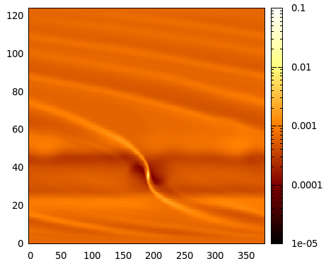
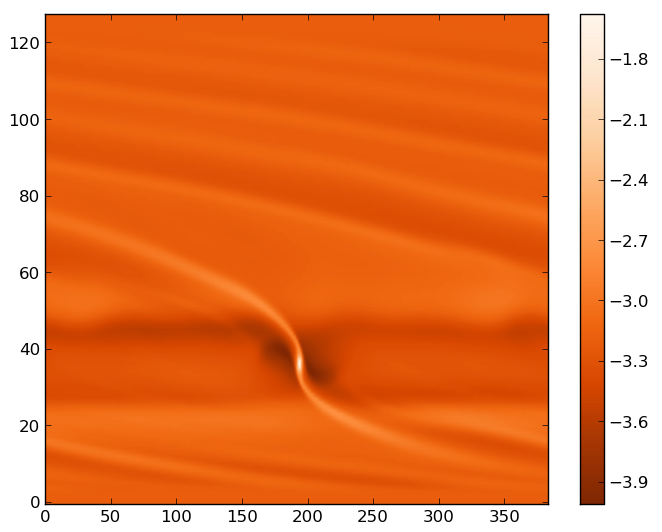

First Steps
============

Getting FARGO3D
---------------

FARGO3D can be downloaded from the same webpage as the public FARGO
code (http://fargo.in2p3.fr). In that page, you will find a *tar.gz*
file, with all the sources inside. You can check the README file which
contains some basic installation tips. Hereafter is a set of detailed
instructions. If you have trouble at some stage, read the
troubleshooting first, and if your problem is not solved you may send
an email to the discussion group, asking for help.

Installing
-----------

.. warning:: This document was written for UNIX-type systems. We have
   not tested the behavior of FARGO3D on a Windows system.

Suppose you have downloaded the code to your download directory
(USER_PATH/downloads), where USER_PATH is the path to your user (eg:
/home/pablo/downloads/). You need to decide where you want to install
FARGO3D. We assume in the following that you install it in the
directory USER_PATH/fargo3d. In order to do that, the steps are::

   $: cd USER_PATH (or simply: 'cd')
   $: cp USER_PATH/downloads/fargo3d.tar.gz USER_PATH/
   $: tar -xvf fargo3d.tar.gz

If all went fine, you will see directories called bin, src, outputs,
setups, etc::

   :USER_PATH/fargo3d/$ ls
   bin  doc  Makefile  outputs  planets README  scripts  setups  src  std  test_suite  utils

You are now ready to build the code and do your first run.

First run
---------

The first run of FARGO3D is the same first run as the one of its
ancestor FARGO (you can see the documentation of FARGO for
details). In order to build the code, go to the ``USER_PATH/fargo3d``
directory (*not the src/ directory !*) and issue:

  $: make

.. warning:: You must use the GNU make utility. The build process
   relies upon several important features of the GNU make. We have
   tested the compilation process with GNU Make 3.81.  We have
   thoroughly tested the build process with python version 2.7. It may
   work with older versions of Python too. However, should you
   experience unexpected results during the build process with an
   older version of python, we recommend that you update it to 2.7.x
   <= python version < 3. Issue *python -V* at the command line to
   know your version. No additional libraries are required for this
   simple first build.

With this instruction, you will have a sequential (or serial) version
of the binary (ie, without MPI), meant to run on one CPU core only. By
default, this sequential version cannot run on a GPU. After the
building process, you will see a message similar to::

             FARGO3D SUMMARY:
             ===============            
   
   This built is SEQUENTIAL. Use "make para" to change that
   
   
   SETUP:      'fargo'         
   (Use "make SETUP=[valid_setup_string]" to change set up)
   (Use "make list" to see the list of setups implemented)
   (Use "make info" to see the current sticky build options)

We will go through the details of this note in the next sections, but
for now, the important thing is that the code was compiled in
*SEQUENTIAL* mode, and the *SETUP* is 'fargo'. This means that the
code was compiled in a mode that is very similar to the FARGO
code. Actually, the first run of FARGO3D is the same first run of
FARGO (A Jupiter like planet embedded in a 2D cylindrical gas disk).

.. warning:: A note to former FARGO users: the *setup* must not be
   confused with the *parameter file*. The *setup* is chosen at build
   time, and contains fundamental information about the executable
   produced (MHD on or off, mesh geometry, equation of state used,
   number of dimensions, etc.) An executable build for a given setup
   can then be run on as many parameter files as required, without any
   rebuild.

If you have a look at the content of the main directory, you will see
that after the compilation a new file has been created, called
'fargo3d'. This file is the binary file. We can now perform the first
run::

  $: ./fargo3d setups/fargo/fargo.par

And you will see the following lines::

   x = 1.0000000000	y = 0.0000000000	z = 0.0000000000
   vx = -0.0000000000	vy = 1.0004998751	vz = 0.0000000000
   Non-accreting.
   Doesn't feel the disk potential
   Doesn't feel the other planets potential
   
   Found 0 communicators
   OUTPUTS 0 at date t = 0.000000 OK
   TotalMass = 0.0121800000 
   .............
   ................
   .................
   ...................
   ...................
   .....................
   ..................
   ...................

All right, all works fine. These lines should look familiar to former
FARGO users All the outputs are written to ``outputs/fargo``. You can
now open it with your favorite data reduction software. We include in
the following some examples of how to visualize this first data. We
will assume that you run the test at least until the output 10.

**Note**: For all the instructions, it is assumed you are in
``outputs/fargo`` directory. You may go to this directory by issuing
``cd outputs/fargo`` from the USER_PATH.

Gnuplot
.......

Gnuplot (http://www.gnuplot.info/) is a portable command-line driven
graphing utility, and it is a useful tool for showing the outputs of
FARGO3D. Here you have an example on how to load the outputs of
FARGO3D on our two-dimensional first run.

The command line should be similar to::

  $: gnuplot
  Version 4.6 patchlevel 1    last modified 2012-09-26 
  .
  .
  .  
  gnuplot> set palette rgbformulae 34,35,36
  gnuplot> set logscale cb
  gnuplot> nx = 384; ny = 128
  gnuplot> plot[0:nx-1][0:ny-1] "./gasdens10.dat" binary array=(nx,ny) format="%lf" 
           with image notitle

and you should see an image similar to:

   Gnuplot image of the first run (gas surface density), output number 10.

GDL/IDL
.................................

GDL (GNU Data Language - http://gnudatalanguage.sourceforge.net/) is
an open-source package similar to IDL, but it is free and has similar
functions. The command line should be similar to::
  
  $: gdl
    GDL - GNU Data Language, Version 0.9.2  
  .
  .
  .
  GDL> openr, 10, 'gasdens10.dat'
  GDL> nx = 384
  GDL> ny = 128
  GDL> rho = dblarr(nx,ny)
  GDL> readu, 10, rho
  GDL> rho = rebin(rho, 2*nx, 2*ny)
  GDL> size = size(rho)
  GDL> window, xsize=size[1], ysize=size[2]
  GDL> tvscl, alog10(rho)

and you should see an image similar to:

   GDL image of the first run (gas surface density), output number 10.

Python
......

Python (http://www.python.org/) is one of the most promising tool for
data analysis in the scientific community. The main advantages of
Python are the simplicity of the language and the number of external
libraries. Data reduction of FARGO3D data is straightforward with the
numpy package (http://www.numpy.org/). Also, making plots is extremely
easy with the help of the matplotlib package
(http://matplotlib.org/). We recommend using the interactive
python-shell called IPython (http://ipython.org/).

Here, you have an example of how to visualize data in an interactive
IPython shell::
  
  $: ipython --pylab
    IPython 1.0.0 -- An enhanced Interactive Python.
  .
  .
  .
  In [1]: rho = fromfile("gasdens10.dat").reshape(128,384)  
  In [2]: imshow(log10(rho),origin='lower',cmap=cm.Oranges_r,aspect='auto')
  In [3]: colorbar()

You should see an image similar to (inside a widget):

   Matplotlib image of the first run, output number 10.

More tools
...........

The is a lot of software for reading and plotting data but, in
general, you need an ASCII file with the data. In the utils directory,
you will find some examples of how to transform the data into a
human-readable format, written in different languages. If you are
working with a large data set, this option is not recommended. It is
always a good choice to work with binary files, your outputs are
lighter and the reading process is much faster.

.. warning::

   Using ASCII format is very slow and should never be used for high
   resolution simulations or a 3D run.

Note that FARGO3D can also produce data in the VTK format, which can
be inspected with software such as VISIT. This feature of FARGO3D will
be entertained later in this manual.

First parallel run
-------------------

Until now, we did not need external libraries to compile the code, but
if we want to build a parallel version of the code, we must have a
flavor of MPI libraries on our system.

.. note::
   FARGO3D was successfully tested with:

   * OpenMPI 1.6/1.7
   * MPICH2/3
   * MVAPICH2 2.0

     with a similar overall performance for the CPU version of the
     code.
 

As we do not use any version-dependent features of MPI, we expect the
code to work with any version of MPI. There are however some special
features of MVAPICH 2.0 and OpenMPI 1.7 related to CUDA
interoperability that are discussed later in this manual, and that are
useful exclusively for GPU builds.

If you are running on a standard Linux installation, with a standard
working MPI distribution, you have to issue::

  $: make PARALLEL=1

or the corresponding shortcut::

  $: make para

At the end of the process, you will see a message, telling you that
the compilation was performed in parallel. Now, you can run the code
in parallel::

  $: mpirun -np 4 ./fargo3d setups/fargo/fargo.par

If your computer have at least four physical cores, you should see a
speed-up of a factor ~4.

.. note:: 
   Open-MPI-Installation on Ubuntu systems.
   If you have Ubuntu, these lines install a functional version of OpenMPI::

     $: sudo apt-get install openmpi-bin
     $: sudo apt-get install openmpi-common
     $: sudo apt-get install libopenmpi-dev

   You must accept all the installation requirements. This process is
   similar on other Linux-systems with a package manager. Similar
   packages exist for MPICH.

First GPU run
--------------

.. warning::

  We assume you have installed CUDA and the proper driver on your
  system. You can test if the driver works correctly by running
  ``nvidia-smi`` in a terminal. It is also a good idea to run a few
  examples of the NVIDIA suite to ensure that your installation is
  fully functional.

Running FARGO3D in GPU mode is similar to the first parallel run. The
only important thing is to know where CUDA is installed. FARGO3D knows
about CUDA by the environment variable ``CUDA`` defined in your
system. If you do not have the ``CUDA`` variable defined, FARGO3D
assumes that the default path where CUDA is installed is
*/usr/local/cuda*. If this is not the right place, modify your
``.bashrc`` file and add the following line::

  ``export CUDA=Your CUDA directory``

.. warning::
   The above example assumes that you use the bash shell.

After that, we are ready to compile the code::

  $: make PARALLEL=0 GPU=1

or the corresponding shortcut::

  $: make PARALLEL=0 gpu

.. warning:: you cannot combine shortcuts in the command line. You
	     could for instance issue ``make seq GPU=1`` instead of
	     the instruction above (``seq`` stands for
	     ``PARALLEL=0``), but ``make seq gpu`` would fail.

.. note:: Additional information

	  We assume here that you followed the whole sequence of
	  examples of this page, so that your previous run was a
	  parallel CPU run. Build options (such as ``PARALLEL=1``) are
	  *sticky*, so that they are remembered from build to build
	  until their value is explicitly changed. Since we want here
	  a *sequential* built for one GPU, we need to explicitly
	  reset the value of PARALLEL to zero.

	  Another option is to issue::
   
	    make mrproper

	  which resets all sticky built options to their default
	  values, and after that issue::
     
	    make gpu

You will see at the end of the building process the message::

	          FARGO3D SUMMARY:           
	          ===============            
	
	This built is SEQUENTIAL. Use "make para" to change that
	
	This built can be launched on
	a CPU with a GPU card (1 GPU only).
	
	
	SETUP:      'fargo'         
	(Use "make SETUP=[valid_setup_string]" to change set up)
	(Use "make list" to see the list of setups implemented)
	(Use "make info" to see the current sticky build options)

telling you that the build is sequential and should be run on a
GPU. To run it, simply type::

  $: ./fargo3d setups/fargo/fargo.par

Before the initialization of the arrays, you will see a block similar to::

  =========================
  PROCESS NUMBER       0
  RUNNING ON DEVICE Nº 0
  GEFORCE GT 520
  COMPUTE CAPABILITY: 2.1
  VIDEO RAM MEMORY: 1 GB
  =========================

It is the information about the graphics card used by FARGO3D. If you
see some strange indications in these lines (weird symbols, an
unreasonable amount of memory, etc), it is likely that something went
wrong. The most common error is a bad device auto-selection.

.. warning::
   In the jargon of GPU computing, the *device* is the name for a
   given *GPU*. We shall use indistinctly these two terms throughout
   this manual.

If you need to know the index of your device, you can use the *nvidia-smi* monitoring software::

  $: nvidia-smi

You may then explicitly specify this device on the command line (here
e.g. 0)::
  
  $./fargo3d -D 0 setups/fargo/fargo.par

In general, expensive cards support detailed monitoring, but at least,
the memory consumption will be given even for the cheapest ones. Also,
you can check the temperature of your device. An increasing temperature
is a good indication that FARGO3D is running on the desired device.

.. note:: Useful comments

   **Note 1**:

   If you cannot run on a GPU after reading the above instructions,
   you should try to check the index of your device (normally it is 0
   is you have only one graphics card) with ``nvidia-smi``::

        $: nvidia-smi        

	+------------------------------------------------------+                       
	| NVIDIA-SMI 4.310.44   Driver Version: 310.44         |                       
	|-------------------------------+----------------------+----------------------+
	| GPU  Name                     | Bus-Id        Disp.  | Volatile Uncorr. ECC |
	| Fan  Temp  Perf  Pwr:Usage/Cap| Memory-Usage         | GPU-Util  Compute M. |
	|===============================+======================+======================|
	|   0  GeForce GT 520           | 0000:01:00.0     N/A |                  N/A |
	| 40%   37C  N/A     N/A /  N/A |  18%  182MB / 1023MB |     N/A      Default |
	+-------------------------------+----------------------+----------------------+
	                                                                               
	+-----------------------------------------------------------------------------+
	| Compute processes:                                               GPU Memory |
	|  GPU       PID  Process name                                     Usage      |
	|=============================================================================|
	|    0            Not Supported                                               |
	+-----------------------------------------------------------------------------+

     And the number of the GPU, in this case, is 0. So, you could try to run FARGO3D forcing the execution on the device 0::

       $: ./fargo3d -D 0 setups/fargo/fargo.par

   **Note 2**:

   We have used two sticky flags: ``PARALLEL`` and ``GPU``, and after
   a while you may wish to know which ones are activated. In order to
   know the current status of the executable, issue::

     $: make info
     
     Current sticky build options:

     PROFILING=0
     RESCALE=0
     SETUP=fargo
     PARALLEL=0
     FARGO_DISPLAY=NONE
     FULLDEBUG=0
     UNITS=0
     GPU=1
     DEBUG=0
     MPICUDA=0
     BIGMEM=0

   You will see the meaning of each flag later on in this manual.

All the information about how to open and visualize your fields is
still valid. While the computation was done on the GPU, 
all necessary data transfers were run in a transparent manner from the
GPU to the CPU before a write to the disk. For you, nothing changes,
except the execution speed.

First Parallel GPU run
-----------------------

The same ideas as before can be used for running FARGO3D on multiple
GPUs. But we cannot give a set of instructions because they are
cluster-dependent. In the next sections, you will learn how to run
FARGO3D on a large cluster and have each process select adequately its
device, according to your configuration. When you know how to work
with the internal ``SelectDevice()`` function, you will be able to work with
FARGO3D on a cluster of GPUs.

You could try to run with MPI over one GPU. Of course, it is a bad idea
for performance reasons, but it shows if all the parallel machinery
inside FARGO3D works. (Actually, for developing an MPI-CUDA code, you
do not need more than one thread and one GPU card!).

Try the following::

  $: make mrproper
  $: make PARALLEL=1 gpu
  $: mpirun -np 2 ./fargo3d setups/fargo/fargo.par

If all goes fine, that is to say, if the output looks correct, FARGO3D
is working with MPI and GPUs. The next step is to configure it to run
on a cluster of GPUs, using as many different GPUs as possible. We
will learn how to do that later on in this manual

