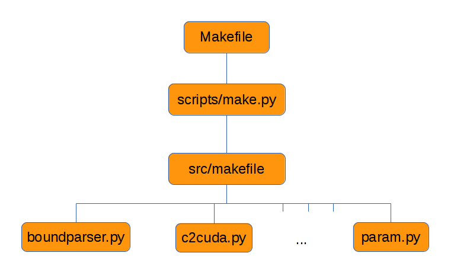

.. _MakePro:

Make Process
=============

Building the code is achieved simply by invoking the Makefile in the
main directory. The Makefile contains the set of instructions that
build the executable, normally called "fargo3d" according to a
specific setup and with proper instructions for generating a CPU, GPU,
sequential or parallel built. This Makefile is not standalone. A set
of scripts was developed in order to simplify the building
process. These scripts do all the hard work. 
Most users will not need to know the different stages of a build, but
we give here the detail of what happens when you issue ``make
[options]`` in the main directory.

A schematic view of the make process is:

We can see that the make process involves three main steps. When we
type ``make`` in the main directory, we spawn the first step, that is
we execute the Makefile. All the shortcut rules, cleaning rules, and
testing rules are defined within. The second step is spawned by the
Makefile itself, and amounts to running the ``scripts/make.py`` file,
that works as a link between the main Makefile and the
``src/makefile`` file.  The third and last step corresponds to
the execution of the ``src/makefile`` . All the scripts are managed
at this stage (automatic conversion of C to CUDA, analysis of boundary
conditions and scaling rules, etc.)

Makefile (Stage1)
------------------

As we have just seen the first file related with the make process is
"Makefile" in the main directory. Inside, there is a set of
instructions that manages the build variables (such as GPU, PARALLEL, etc.)
This makefile works as a
wrapper that further invokes ``scripts/param.py``. There are two
ways to define a build variable from the command line: using
shortcut rules, or defining the value of the variables manually. The
set of variables allowed are:

------

* ``PROFILING: [0,1]`` The profiler flags and a set of timers will be
  activated. Useful for benchmarks and development.

------

* ``RESCALE: [0,1]`` Activates a rescaling of the (real) parameters of the
  parameter file to certain units. The numerical values used for this
  rescaling depends on the value of the build variable ``UNITS``. The
  output are all done with the new units.

------

* ``SETUP``: Selects the proper directory where your setup is. A list
  will be shown if you type ``make list``.

------

* ``MPICUDA: [0,1]`` Activates the peer2peer/uva MPI-Communications
  between different devices. Only compatible with MVAPICH2 2.0 and
  OpenMPI 1.7. (Strongly recommended)

------

* ``FARGO_DISPLAY: [NONE,MATPLOTLIB]`` Run time visualization of your
  fields using python-numpy-matplotlib packages.

------

* ``DEBUG: [0,1]`` The code will be compiled in debug mode. The main
  change is the flag "-g" at compilation time. No optimization is
  performed in this mode.

------

* ``FULLDEBUG: [0,1]`` The code runs in full debug mode. Similar to
  debug mode, but the merge flag (``-m``) is not allowed. All the
  fields are dumped with their ghosts cells (*buffers*).

------

* ``UNITS: [0,MKS,CGS]`` How the units are interpreted by the
  code. See the unit section for further details.

------

* ``GPU: [0,1]`` Activates a GPU compilation.

------

* ``PARALLEL: [0,1]`` Activates the use of the MPI Libraries.

------

* ``BIGMEM: [0,1]`` Activates the use of the global GPU memory to
  store light (1D) arrays (which are otherwise stored in the so-called
  *constant memory* on board the GPU). Normally, it is needed when
  your simulation exceeds ~750 cells in some direction. This feature
  is device-dependent. Typically, a 3D run with mesh size 500*500*500
  does **not** require ``BIGMEM=1``, but a 2D run with mesh size
  50*1000 **does**. However, when ``BIGMEM=1`` is not required, you
  may activate it. Perform some benchmarking to check which choice
  yields faster results. This is problem and platform dependent.

------

* jobs/JOBS: [N] where N is the number of processes that you want to
  spawn for building the code. By default N=8. This option is much
  needed when working with CUDA. The building process of CUDA object
  files is by far the most expensive stage of building a GPU instance
  of FARGO3D, as you will soon realize.

------

All these variables must be defined by: ``make VARIABLE=VALUE``.

The shortcut rules are invoked with the command ``make option``, where
option can be:

------

* cuda/nocuda, gpu/nogpu --> GPU=1/0

------

* bigmem/nobigmem --> BIGMEM=1/0

------

* seq/para --> PARALLEL=0/1

------

* debug/nodebug --> DEBUG=1/0

------

* fulldebug/nofulldebug --> FULLDEBUG=1/0

------

* prof/noprof --> PROFILING=1/0

------

* mpicuda/nompicuda --> MPICUDA=1/0

------

* view/noview --> FARGO_DISPLAY=MATPLOTLIB/NONE

------

* cgs/mks/scalefree --> UNITS=CGS/MKS/0

------

* rescale/norescale --> RESCALE=1/0

------

* testlist --> A list of the tests implemented.

------

* testname --> the test called ``name.py``, found in ``test_suite``,
  will be executed.

------

* blocks --> special syntax: ``make blocks setup=SETUPNAME``. Performs
  a detailed study of the performance of your graphics card with
  respect to the size of the CUDA blocks. This test will be done for
  each GPU function. The result is stored in
  setups/SETUPNAME/SETUPNAME.blocks (go to the section "Increasing the
  GPU performance"). A build is performed with a default block size if
  this file does not exist, so you do not have to worry about this
  feature at this stage. However, remember that it may increase the
  performance up to ~20 %.

------

* clean --> Cleans the ``bin/`` directory. Recommended when you switch
  to another SETUP.

------

* mrproper --> Removes all the data related to some specific make
  configuration. All the code is restored to its default. The
  ``outputs`` directory will not be touched.

------

scripts/make.py (Stage2)
-------------------------

The second step in the building process is to call ``make.py``. This
file does not need a manual invocation, and is launched from the main
Makefile (stage1).  In general, the compilation process is expensive
when you are working with CUDA files. For this reason, a parallel make
process is highly desirable. Normally, a general Makefile can handle
parallel compilation, but in the FARGO3D case (that uses a lot of
scripting) some race conditions could appear in parallel
Makefiles. Since the GNU make utility does not have a proper way to
avoid such problem, we developed an interface between Makefile and
src/makefile to do all the building process in the right order: first
invoking the scripts to build all the headers and variable
declarations and then a parallel execution of ``src/makefile``. Also,
``make.py`` keeps track of the last flags used in the last built
(sticky options). All this information is stored in the hidden file
``std/.lastflags``.

src/makefile (Stage3)
----------------------

The third and last step in the building process is to call
``src/makefile``, which is done by ``scripts/make.py``. The role of
this makefile is to build the executable, normally called ``fargo3d``
in the main directory. All the calls to scripts are done here. Inside
there are a set of rules for making the executable in the correct
sequence. You may have a look through these different rules,
which are self-documented by their
names.

There is a set of system-configuration blocks, that allows building
FARGO3D on different platforms with the same makefile. This
configuration blocks are selected by using the environment variable
called FARGO_ARCH (the same as for the FARGO code). Also, inside this
makefile are defined a lot of useful variables. Here is where the
structure of the code is defined, and where the variable VPATH is
specified. This variable is extremely powerful, and if you want to
extend the FARGO3D directory structure, you should learn about the use
of this variable (GNU Make Reference Guide).

Another important set of variables are:

* MAINOBJ: The name of all the CPU objects that will be linked with
  the final executable. All new source file in the code must be
  included in this variable (with the .o extension, instead of .c)
* GPU_OBJ: The name of the static kernels used in the code. In
  practice, you will never need to touch it. By static we mean
  that these few kernels are not generated automatically from the C
  code by a Python script.
* GPU_OBJBLOCKS: The name of the objects that will be generated by the
  script c2cuda.py. Note all of them must have the suffix _gpu.o, with a
  prefix that is the one of the corresponding C file. This is very
  important, because the rule that generates CUDA-files from
  C-files uses the suffix of the object name. In the tutorial on how to
  develop a GPU-Routine (function) this will be presented in more detail. 
  All the functions that must be generated automatically from C code
  at build time must appear as a list in this variable.

FARGO_ARCH environment variable
--------------------------------

FARGO3D is a multi-platform code, and can run on a modern cluster of
GPUs but also on your personal computer, even without a GPU. For
the ease of use, we adopt a computer-dependent
makefile scheme, managed by the environment variable *FARGO_ARCH*.

You can see in ``src/makefile`` a group of lines similar to::

  #LINUX PLATFORM (GENERIC)
  #FARGO_ARCH must be set to LINUX
  CC_LINUX      = gcc 
  SEQOPT_LINUX  = -O3 -ffast-math
  PARAOPT_LINUX = ${SEQOPT_LINUX}
  PARACC_LINUX  = mpicc
  LIBS_LINUX    = -lm
  INC_LINUX     = 
  NVCC_LINUX    = nvcc
  PARAINC_LINUX = 
  PARALIB_LINUX =

These lines are telling the makefile where the libraries are and which
compilers will be used. In the LINUX case (default case), we are not
including any parallel library to PARALIB and any header to PARAINC
because we are assuming they are in your LD_LIBRARY_PATH, or they are
installed in the default places. In general, in your cluster, you
should have something similar to::

  #FARGO_ARCH must be set to MYCLUSTER
  CC_MYCLUSTER      = /bin/gcc 
  SEQOPT_MYCLUSTER  = -O3 -ffast-math
  PARAOPT_MYCLUSTER = ${SEQOPT_LINUX}
  PARACC_MYCLUSTER  = /bin/mpicc
  LIBS_MYCLUSTER    = -lm
  INC_MYCLUSTER     = 
  NVCC_MYCLUSTER    = ${CUDA}/bin/nvcc
  PARAINC_MYCLUSTER = -I/${MPIDIR}/include
  PARALIB_MYCLUSTER = -L/${MPIDIR}/lib64

Where *MPIDIR* and *CUDA* are variables pointing to the place where MPI and Cuda are installed.

To use the ``FARGO_ARCH`` variable, you have two options:

* define FARGO_ARCH before compiling the code.
* define FARGO_ARCH in your personal ``.bashrc`` or ``.tcshrc`` file
  (depending on your shell).

If you do not have a standard Linux distribution, do not forget to
export the variable FARGO_ARCH in your ``~/.bashrc`` file::

  $: vi USER_DIR/.bashrc

and add the following line::

  export FARGO_ARCH=MYCLUSTER

where *MYCLUSTER* is only an example name. You should modify it to
match the name that you defined in the ``src/makefile``. This file is
provided as is with a few examples that you may adapt to your own needs.
