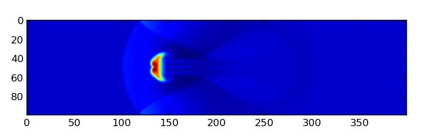

Defining a new SETUP
=====================

This section is a small tutorial on how to define a setup from
scratch. In this tutorial we will implement a hydrodynamics
setup. The setup we will define is "blob", that comes implemented in
the public version of FARGO3D.

Blob test
----------

This is a 2D test characterized by a uniform fluid, with a denser
fluid disk embedded. The system is force-balanced (ie in pressure
equilibrium) if there is no velocity between the two fluids. The
disk is moving at a supersonic speed. In order to compare our
results, we will develop the same parameters as
http://www.astrosim.net/code/doku.php?id=home:codetest:hydrotest:wengen:wengen3.

Parameters of the test:

* Mach number: 2.7
* Density jump: 10
* Pressure equilibria
* gamma: 5/3

We will do the test in the XY plane, and we will implement periodic
boundaries in X and reflexive boundaries in Y. We will do a second
test with free outflow boundaries in Y.

In order to implement this setup we need:

1) A setup name: In this case will be "myblob".
2) Therefore a directory inside ``setups/`` called ``myblob``.
3) the ``.bound`` file in that directory, called ``myblob.bound.0``.
4) the ``.par`` file in that directory, called ``myblob.par``.
5) the ``.opt`` file in that directory, called ``myblob.opt``.
6) the file called ``condinit.c`` in that directory. This is   where the fields are initialized.

Optionally:

* the ``.units`` file, called ``myblob.units``.
* the ``.mandatory`` file, called ``myblob.mandatory``.
* the ``.objects`` file, called ``myblob.objects``.
* A ``boundaries.txt`` file (if it is not present it will be taken
  from the ``std/`` directory).

Making the setup directory:
.....................................................

We start by creating the setup directory ``myblob``::

 $: cd setups/
 $: mkdir myblob

Defining boundaries:
.......................................

We define from scratch all the boundaries in the setup. In order to do
that we create a file called ``boundaries.txt`` inside ``setups/myblob/``::

 $: emacs boundaries.txt   

Naturally, you may use your favorite editor instead of emacs...

Now, we write these lines::

	SYMMETRIC:
		   Centered:	|a|a|
		   Staggered:   |a|a|a|
	
	ANTISYMMETRIC:
		   Staggered:	|-a|0|a|

    
We will use the SYMMETRIC boundary for both reflective and free
outflow boundaries, 
and ANTISYMMETRIC only for the normal velocity Vy in the reflective case.

We must create the file myblob.bound::

 $: emacs myblob.bound.0

And write this lines::

	Density:
		Ymin: SYMMETRIC
		Ymax: SYMMETRIC
	
	Energy:
		Ymin: SYMMETRIC
		Ymax: SYMMETRIC
	
	Vx:
		Ymin:	SYMMETRIC
		Ymax:   SYMMETRIC
	
	Vy:
		Ymin:	ANTISYMMETRIC
		Ymax:   ANTISYMMETRIC

We say that all our fields are symmetric, but vy should be reflected
in Y. This set is the reflective boundary condition on Y. The free
outflow is the same, except for::

	Vy:
		Ymin:	SYMMETRIC
		Ymax:   SYMMETRIC

.. _parfile:

Defining the parameter file
.....................................................

The parameter file is very useful when we want to change a value
inside the code but you do not want to recompile the code. It is used
in much the same way as with the former FARGO code. Yet in that code,
parameters were defined in a rather manual way, in a file called
``var.c``. With FARGO3D we do not have to edit this file. Rather, we
provide in the SETUP sub directory a template parameter file that has
same name as the setup plus the .par extension. From this file, a
Python script will automagically draw a list of all global variables
and guess their type, and will make a ``var.c`` accordingly, in a
manner transparent to the user. At run time the user is free to run the
code either with this .par file, or any other .par file in another
directory, without rebuilt.

There are a set of minimal requirement in a .par file, related with
the mesh size, and output parameters. We will start with the basic
parameters:

We edit the new file ``myblob.par``::

  $: touch myblob.par

and write inside something similar to::

	Setup			myblob

	Nx			400
	Ny			100
	Xmin		       -2.0
	Xmax			2.0
	Ymin		       -0.5
	Ymax			0.5
	
	Ntot			1000
	Ninterm	 		1
	DT			0.05
	OutputDir		outputs/myblob

.. warning::
   Because a Python script will automagically create a ``var.c`` file
   (similar to that of the former FARGO code) out of this newly
   created parameter file, we must help the script to guess correctly
   the type of each variable. For instance, if we write "Xmin   -2"
   instead of "Xmin   -2.0", it will wrongly deduce that *Xmin* is an
   integer, not a floating point value, with highly unpleasant
   consequences at run time. Similarly, the figure "-0.5" is correctly
   recognized by the script, but "-.5" would not be.

Now, we will define the parameters specific to our setup. They are::

        gamma                   1.666667
	rho21			10.0
	mach			2.7
	rblob			0.15
	xblob		       -1.0
	yblob			0.0

where gamma is the adiabatic index, rho21 is the quotient between the
density in the circle (2) and outside (1), and the same for the
temperature; rblob is the radius of the initial blob, normalized by
the vertical size of the box; [xy]blob is the initial position of the
blob.

The observant reader will notice that *gamma* is already defined in
``std/stdpar.par``, with the same value. Since both sets of parameters
are used (those of ``std/stdpar.par`` and those of
``setups/myblob/myblob.par``), the first line in the block above is
actually redundant and could have been omitted.

.opt file.
..........

Our setup is 2D, and we want to use the energy equation. In the code's
jargon, we refer to this as an *adiabatic* situation. We work in Cartesian coordinates::

 $: emacs myblob.opt

The minimal ``.opt`` file should be similar to::

  
        FLUIDS := 0
        NFLUIDS = 1
        FARGO_OPT += -DNFLUIDS=${NFLUIDS}
	
	FARGO_OPT += -DX
	FARGO_OPT += -DY
	FARGO_OPT += -DADIABATIC
	FARGO_OPT += -DCARTESIAN
	ifeq (${GPU}, 1)
	FARGO_OPT += -DBLOCK_X=16
	FARGO_OPT += -DBLOCK_Y=16
	FARGO_OPT += -DBLOCK_Z=1
	endif

If you want to use simple precision, you can set::

	FARGO_OPT += -DFLOAT

Initial state:
--------------

Now we must fill all the primitive fields with the initial conditions. The standard method is as follow, step by step: 

1) Make a file called condinit.c inside your setup directory. (setups/myblob/condinit.c).
2) At the top of this file include the ``fargo3d.h`` header.
3) Define a function called CondInit() that returns a ``void``.
4) Fill the Field_variable->field_cpu with the data, for each field of
   the problem.

**step by step**
  
1) Start by opening the new file for initial conditions::
   
     $: emacs condinit.c

2) In the top line include FARGO3D's header file::

     #include "fargo3d.h"

3) Subsequently add lines similar to these::

	void Init() {
	
	
	}

4) Write inside the function something similar to::

	  int i,j,k;
	
	  real* rho = Density->field_cpu;
	  real* vx  = Vx->field_cpu;
	  real* vy  = Vy->field_cpu;
	  real* e   = Energy->field_cpu;

	  i = j = k = 0;

	  for (k = 0; k<Nz+2*NGHZ; k++) {
    	    for (j = 0; j<Ny+2*NGHY; j++) {
    	      for (i = 0; i<Nx; i++) {
	      
	      The fields are filled here with the help of the "l" index.

	      }
	    }	      
	  }

   This is the basic structure of a routine that works on
   fields. Note the pointers and the triple-nested loop. For filling
   the fields, we will use the helper index "l". In this case, the
   outer loop is not necessary, but when Z is not defined, by default
   NGHZ = 0 and Nz = 1, so there is only one external loop
   cycle. Also, in this particular case, we need to define a circle,
   and the size of the circle should be resolution-independent, so we
   will need to normalize it. We could add the following macrocommand
   lines above the initialization of the indices i,j,k ::

   #define Q1 (xmed(i) - XBLOB)
   #define Q2 (ymed(j) - YBLOB)

   (Remember, all the upper variables are taken from the .par file.)

   Now, inside the innermost loop, we will fill the field. First, we
   need a condition about where the blob is::

          if(sqrt(Q1*Q1+Q2*Q2) < RBLOB/(YMAX-YMIN)) {
   
          }  
	  
   And inside these curly brackets, for example, the density must to
   be RHO21 times denser than the density outside. The inner loop
   should be similar to::

          rho[l] = 1.0;  	      // Constant value outside
      	  e[l]   = 1.0/(GAMMA-1.0);   // The isothermal soundspeed is equal to 1.0.
   	  vx[l]  = sqrt(e[l]*(GAMMA-1.0))*MACH;
      	  vy[l]  = 0.0;   

          if(sqrt(Q1*Q1+Q2*Q2) < RBLOB/(YMAX-YMIN)) {
   	        rho[l] *= RHO21;
      	        vx[l] = 0.0;
          }

   Finally, it is mandatory to call the function Init() from one labeled CondInit(). This function also needs to create the fluid number 0 (the only fluid present in this setup)::

     void CondInit() {
        Fluids[0] = CreateFluid("gas",GAS);
        SelectFluid(0);
        Init();
     }
  
A complete view of the file ``condinit.c`` is::

        #include "fargo3d.h"

	void Init() {

	  int i,j,k;
	
	  real* rho = Density->field_cpu;
	  real* vx  = Vx->field_cpu;
	  real* vy  = Vy->field_cpu;
	  real* e   = Energy->field_cpu;

          #define Q1 (xmed(i) - XBLOB)
          #define Q2 (ymed(j) - YBLOB)

	  i = j = k = 0;

	  for (k = 0; k<Nz+2*NGHZ; k++) {
    	    for (j = 0; j<Ny+2*NGHY; j++) {
    	      for (i = 0; i<Nx; i++) {

                rho[l] = 1.0;               // Constant value outside
      	        e[l]   = 1.0/(GAMMA-1.0);   // The isothermal soundspeed is equal to 1.0.
	  	vx[l]  = sqrt(e[l]*(GAMMA-1.0))*MACH;
      	        vy[l]  = 0.0;               

                if(sqrt(Q1*Q1+Q2*Q2) < RBLOB/(YMAX-YMIN)) {
   	          rho[l] *= RHO21;
		  vx[l] = 0.0;
                }
	      }
	    }      
	  }
	}

	void CondInit() {
           Fluids[0] = CreateFluid("gas",GAS);
           SelectFluid(0);
           Init();
        }

Making the executable:
----------------------

We are now ready to build the code::

  $: make SETUP=myblob view

You may skip the final rule "view" if the build process fails (you
need to install Python's matplotlib for it to work).

If everything goes fine, you should see a message similar to::

	All objects are OK. Linking stage
	
	          FARGO3D SUMMARY:           
	          ===============            
	
	This built is SEQUENTIAL. Use "make para" to change that
	
	This built has a graphical output,
	which uses the python's matplotlib library.
	Use "make noview" to change that.
	
	
	SETUP:      'myblob'         
	(Use "make SETUP=[valid_setup_string]" to change set up)
	(Use "make list" to see the list of setups implemented)
	(Use "make info" to see the current sticky build options)

  And finally, we can execute the test:

* $: ./fargo3d setups/myblob/myblob.par

If you want to change the boundaries, you must modify ``myblob.bound.0``
and recompile the code (``make`` again).

Plotting your new setup:
------------------------

If you have ipython+pylab working, plotting your new setup is very
easy (see the first run section).

* $: ipython --pylab
* In [1]: rho = fromfile("outputs/myblob/gasdens10.dat",dtype='float32').reshape(100,400)
* In [2]: imshow(rho)

   myblob setup at output number 10 (ie at date = OUTPUTNB * NINTERM * DT
   = 0.5 here)

Run-time visualization.
======================================

FARGO3D has a visualization module, that can be activated for a
specific setup by doing::

  $:make SETUP=setup view

or the equivalent form::

  $:make SETUP=setup FARGO_DISPLAY=MATPLOTLIB

In order to use it you need to have a python-development package (if you are using some package-manager) or simply a basic python installation (the file python.h is needed at compilation time). Also, it is mandatory to have installed matplotlib and numpy packages.

How does it work?
--------------------------

Run-time visualization uses an embedded Python interpreter running at
the same time as your simulation. All the related routines are in
``src/matplotlib.c``. The scheme developed to visualize data allows you
to make a visualization routine adapted to your needs. If you work
with matplotlib, you will see that making an interactive plot from within FARGO3D
is the same as working in an interactive session of python+matplotlib. By
default there are three main routines, called ``plot1d()``, ``plot2d()`` and
``plot3d()``. The functionality of each one is obvious from the name. The
most important line for the run-time visualization is::

  Py_InitializeEx(1);
  
Upon execution of this function, you are able to execute any python command inside FARGO3D. A helper function was developed for passing values from FARGO3D to the python interpreter::

  void pyrun(const char *, ...);

The ``pyrun()`` function works identically to ``printf()`` (man 3
printf), but ``pyrun()`` returns a ``void``. The main difference
between ``printf()`` and ``pyrun()`` is that ``pyrun()`` prints on the python
interpreter, and the text printed is interpreted as a python
command. In the background, ``pyrun`` is only a wrapper to the function
``PyRun_SimpleString()``.

In the basic public implementation of the run-time visualization, a set
of helper parameters have been implemented. These parameters should be
included in your ``.par`` files. You can see the standard value of each
one in ``std/stdpar.par``:

* Field: Name of the field you want to plot. Eg: gasdens
* Cmap: A matplotlib palette. Eg: cubehelix  (related to cmap matplotlib karg)
* Log: If you want to use a logarithmic scale for your color map. Values: Yes/No
* Colorbar: If you want to see the colorbar. Values Yes/No
* Autocolor: If you want a dynamic colorbar between the min and max of the field. Values: Yes/No
* Aspect:	The same as the aspect karg of matplotlib (imshow() method). Values: Auto, None
* vmin: Min value for the colorbar. Only if Autocolor is No
* vmax: Max value for the colorbar. Only if Autocolor is No
* PlotLine: Allows to make an arbitrary plot when your simulation is 3D. The field is stored in a 3D numpy array called field. For example, if you want to plot the 2D Z-sum projection, you should do something similar to::

     PlotLine         np.sum(field,axis=0)

Also, you can make a z-slice doing something similar to::

  PlotLine         field[k,:,:]

where k is an integer with 0<k<NZ.

Backends
--------

Matplotlib uses the concept of backend to refer to some specific set
of widgets used for rendering the plot (eg: qt, tkinter, wx, etc). Not
all the backends are compatible with interactive non-blocking
plots. If the main widget that appears after the execution of FARGO3D
does not work, you can try with another backend (see matplotlib
official documentation for more details).  You could consider adding
the file ``matplotibrc`` to the main FARGO3D directory to configure
matplotlib before running a simulation. This file is
matplotlib-standard (see more details `here <https://matplotlib.org/stable/users/explain/customizing.html>`_), and is version-dependent. If you want to modify
the aspect of the widget, or change the backend, it is a good idea to
start modifying this file.  On linux systems, we tipically use the
backend TKAgg.
