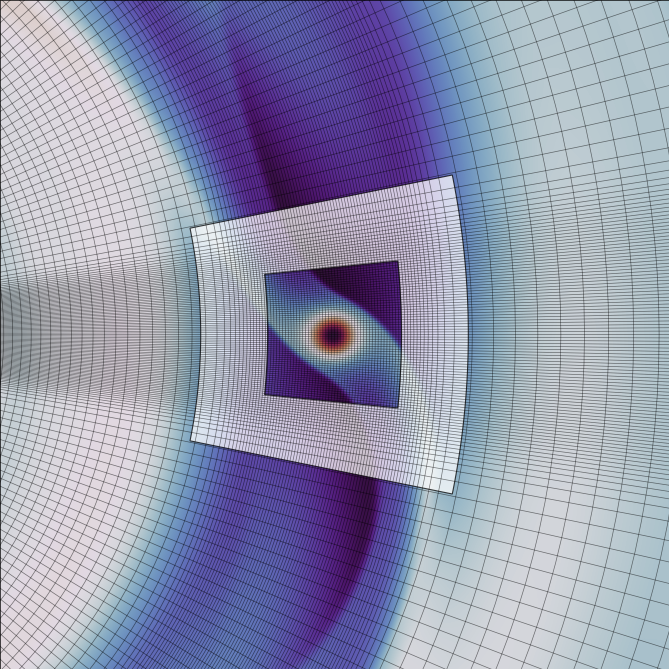

.. _ref_nonuniform:

Non-uniform meshes
==================

.. note::
   
   This extension is described and tested in `Benítez-Llambay et al. (2023) `.

Notes about the non-uniform meshes feature:

* Meshes are created via a mesh-density functions.

* The feature is enabled by setting ``SPACING N`` in the ``.par`` file.

* So far, mesh-density functions are implemented on ``X`` and ``Y`` only.

* Non-uniform meshes in azimuth cannot use FARGO advection. Use ``-DRAM`` in the ``.opt`` instead, which enables
the Rapid Advection Algorithm on Arbitrary Meshes (RAM). RAM is a time-explicit method to solve
the advection equation in problems with large bulk velocity on arbitrary computational grids.

.. warning:: Current implementation of non-uniform meshes is not tested with MHD enabled. It may work with ``-DSTANDARD``, but be careful if you use it. 

.. warning:: Current implementation of the MHD solver does not include RAM.

To test out non-uniform meshes and RAM, the ``fargo_nu`` setup is included. This is a
slightly modified version of the fargo setup with non-uniform spacing and -DRAM enabled in the ``.opt`` file.

First run::
  
   $: make SETUP=fargo_nu
   $: ./fargo3d setups/fargo_nu/fargo_nu.par

As an example, we show a snapshot after 50 orbits.

   The white box corresponds to the transition between resolution levels. It spans a width ``YMB-YMA`` and ``XMB-XMA`` in the radial and azimuthal direction, respectively. 
   
Mesh-density functions implemented
----------------------------------

Mesh density functions are implemented in ``src/mesh.c`` and ``src/defines.h``, and are created in ``src/LowTasks.c``.

Azimuthal and radial spacing are generated via the mesh-density functions described by Eq. (B7) y (B14) in Benítez-Llambay et al. (2023).

Along the azimuthal direction, current implementation assumes the domain to be periodic. 
Three parameters (in the ``.par`` file) control the grid:

* ``XMB``: it controls where the lowest resolution level changes to the next level.
* ``XMA``: it controls where the next level is effectively reached.
* ``XMC``: it controls the resolution ratio between levels.

Notes about the utilization of these parameters:

* In azimuth the mesh has to be centered at the origin.
* ``-XMB`` has to be greater than ``XMIN``.
* ``XMB`` has to be smaller than ``XMAX``.
* ``XMB, XMA`` must be set such that ``XMA<XMB``.
* Low-resolution region spans within ``[XMIN,-XMB]`` and ``[XMB,XMAX]``.
* High-resolution region spans within the range ``[-XMA,XMA]``.
* The transition between resolution levels occur over the width ``XMB-XMA``.

Along the radial direction, four parameters control the grid spacing:

* ``YMA``: analog to ``XMA``
* ``YMB``: analog to ``XMB``
* ``YMC``: analog to ``XMC``
* ``YMY0``: it controls the centering of the mesh

In addition, the radial spacing is constructed such that radial spacing is uniform in 
logarithmic space for ``|y-YMY0|>YMB``.

Implementing a new mesh-density function
----------------------------------------

To implement a new mesh-density function, the following modifications are needed:

* Modify the functions ``ux()``, ``uy()`` in ``src/mesh.c``. These functions are
the cumulative integrals of the mesh-density functions, and are required to generate the mesh
through a bisection algorithm (see ``src/LowTasks.c``, function ``InitSpace()``).

* Modify the macro ``UX`` in ``src/defines.h`` so it matches the definition of ux in ``src/mesh.c``.

* Consider if you need to pass parameters to the cumulative function. In the current version,
we pass parameters as global parameters to ``ux`` to save computing time.  These globals are set by the function
``compute_ux_constants()``, and are later used by the macro ``UX`` (see ``define.h``).

.. warning:: RAM calls ``UX`` both on CPU and GPU to calculate indices efficiently on non-uniform spaces (see ``src/ram_comput_ustar.c``), so consider optimizing any new function implemented.
