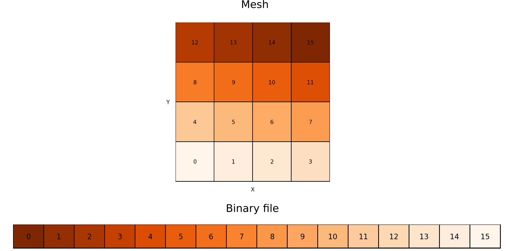

Outputs
=======

FARGO3D has many different kinds of outputs, each one with different
information. They are:

* Scalar fields.
* Summary files.
* Domain files.
* Variables file.
* Grid files.
* Legacy file.
* Planetary files.
* Monitoring files.

This section is devoted to a brief explanation of each kind of files

Scalar fields 
-------------

These files have a ``.dat`` extension. They are unformatted binary
files. The structure of each file is a sequence of doubles (8 bytes),
or floats (4 bytes) if the FLOAT option was activated at build time
(see the section :ref:`optfiles`). The number of bytes stored in a field
file is:

* :math:`8 \times N_x\times N_y\times N_z`
* :math:`4\times N_x\times N_y\times N_z` if the option FLOAT was
  activated.

Remember that :math:`N_x`, :math:`N_y`, :math:`N_z` are the global
variables "NX NY NZ" defined in the .par file (the size of the mesh).

For a correct reading of the file, you must be careful with the order
of the data. The figure below shows how the data is stored in each
file (for 2D simulations, but the concept is the same in 3D).

|
	   
The fast ("innermost") index is always the x-index (index i inside the
code). The next index is the y-index (j) and the last one is the
z-index (k). If one direction is not used (eg: 2D YZ simulation), the
indices used follow the same rule. Note that scalar fields files do
not contain information about coordinates. It is only a cube of data,
without any additional information. The coordinates of each cell are
stored in additional files, called domain_[xyz].dat (see the section
below).

When you use MPI, the situation becomes more complex, because each
processor writes its piece of mesh. If you want to merge the files
manually, you need the information of the grid files, detailed
below. In practice, all the runs are done with the run time flag
``-m`` (merge), in order to avoiding the need for a manual merge. If
your cluster does not have a global storage, you have to do the merge
manually after having copied all files to a common directory.

The fields may be written with a different output format, called
VTK-format. This format is a little bit more complicated and is
discussed in the VTK section.

Here you have some minimalist reading examples with different tools
(additional material can be found in the First Steps section and in
the utils/ directory):

**c**::

  FILE *fi;
  double f[nx*ny*nz];
  fi = fopen(filename, "r");
  fread(f,sizeof(double), nx*ny*nz, fi);
  fclose(f);

**python**::
  
  from pylab import *
  rho = fromfile("gasdens120.dat").reshape(nz,ny,nx)x

**GDL** or **IDL**::

  GDL> openr, 10, 'gasdens10.dat'
  GDL> rho = dblarr(nx,ny)
  GDL> readu, 10, rho
  GDL> close, 10

**fortran**::

  real*8  :: data(nx*ny*nz)
  open(unit=100, status="old", file=filename, &
  &     form="unformatted", access="direct", recl = NX*NY*NZ*8)
  read(100,rec=1) data

**gnuplot**::

  plot filename binary format="%lf" array=(nx,ny) w image

Summary files
----------------

Every time FARGO3D outputs coarse grain scalar fields, a
``summary[i].dat`` file is written to the output directory (where
``[i]`` stands for the output number). This file contains the
following information:

* A section indicating the setup, the code version, the mesh size and
  geometry, the number of outputs scheduled, the number of planets (if
  any), and (if the sticky flag ``LONGSUMMARY`` is defined) the
  filename of the source tar file. The latter is made at build time
  and consists exclusively of the sources found in the VPATH used for
  the build. This archive is copied to the output directory upon the
  run start. Its naming convention is ``sources[n].tar.bz2``, where
  ``[n]`` is the smallest integer for which no such file name exists
  in the directory. Therefore, upon a fresh start in a new directory,
  the archive name will be ``sources0.tar.bz2``. If a restart is
  issued, the subsequent archive file will be ``sources1.tar.bz2`` so
  as to not overwrite the previous source archive (the source may have
  changed between the initial run and the restart). The source archive
  may be expanded using the command ``tar jxvf source[n].tar.bz2``,
  and it expands in a subdirectory ``arch/``.

* A section giving the full set of compilation options of the code.

* A section giving the list of the sticky build flags (only if the
  sticky flag ``LONGSUMMARY`` is defined).

* A section giving runtime information such as the directory from which
  the run was launched, the command line used, the parameter file, the
  number of processes and the host names, together with the
  corresponding rank (and device number for GPU builts).

* A section indicating the time at which the output is performed.

* A section indicating the different preprocessor macros known to the
  code.

* A section listing all the parameters known to the code, in
  alphabetical order. This includes not only those declared in the
  parameter file, but also those which do not appear in that file and
  have a default value.

* A section giving the full content of the parameter file. This
  section should in most cases be redundant with the previous section,
  but the value of some parameters may evolve during execution.

* A section containing the boundary conditions used in the build (only
  if the sticky flag ``LONGSUMMARY`` is defined).

* For the runs which involve at least one planet, a section listing
  the 3 components of each planet position and velocity, as well as
  its mass, and a copy of the planetary system configuration file.

.. note::

   In order to keep the source archive and executable in sync, we
   append trailing information directly to the executable binary file
   (namely, among others, a tar file of the source), at build time
   (only if ``LONGSUMMARY`` is defined). Copying the source files to
   the output directory to keep a track of the code used to generate a
   given data could be misleading if the user edits the source but
   does not recompile the code. Our method is therefore more robust,
   but more involved. It works fine on a variety of
   platforms. However, it requires opening the executable file itself
   as an input stream during execution. This requires that the OS
   allows this type of operation, and that the correct full path to the
   executable is properly retrieved at run time. If you get the message:

   *Attempting to use an MPI routine before initializing MPI
   Cannot open executable file to retrieve information appended.*

   you should check the value of the variables
   ``CurrentWorkingDirectory`` and ``FirstCommand`` in
   ``src/summary.c``, and fix them accordingly. In order to avoid
   potential problems, by default we have deactivated all logging
   which requires interfering manually with the executable (namely
   logging the source tar archive, the sticky flags used at build time
   and the set of boundary conditions). If you want to log this
   information, you must build ``FARGO3D`` with the sticky flag
   ``LONGSUMMARY=1``.  Since the possibility of having long summaries
   is essentially platform dependent (rather than setup dependent),
   you may want to change the default behavior by editing the file
   ``std/defaultflags``.

.. note::

   Even if the sticky flag ``LONGSUMMARY`` is not activated, a
   subdirectory named ``arch/`` is produced in ``FARGO3D``'s main
   directory, which contains all the source effectively used to build the
   code. This includes all the boundary conditions C files derived from
   the setup, the CUDA files in case of a GPU build, etc. This directory
   can be copied for your records to the output directory by your batch
   scheduler.
 

Domain files
------------

Another important piece of output is the domain files:

* domain_x.dat
* domain_y.dat
* domain_z.dat

These three files are created after any run, except if they existed in
the output directory before running your simulation.  The content of
these files are the coordinates of the lower face of each cell
([xyz]min inside the code). They can also be considered as the
coordinates of the interfaces between cells. It is important to note
that ``domain_[yz].dat`` are written *with the ghost cells*. The
format is ASCII, and the total number of lines is:

* domain_x.dat: Nx lines
* domain_y.dat: Ny+2NGHY lines
* domain_z.dat: Nz+2NGHZ lines

where NGHY=NGHZ=3 by default. The active mesh starts at line 4 and has
Ny+1/Nz+1 lines (up to the upper boundary of the active mesh).

If you want to use a logarithmic spacing of the domain, you could set
the parameter ``Spacing`` to ``log`` (see the section "Default
parameters"). If you include in the output directory files with the
name ``domain_[xyz].dat``, their content will be read, which enables
you to handcraft any kind of non-constant zone size.

Variables
---------

When you run the code, two files called ``variables.par`` and
``IDL.var`` are created inside the output directory. These files are
ASCII files containing the same information in two different formats:
the name of all parameters and their corresponding values. IDL.var is
properly formatted to simplifying the reading process in an IDL/GDL
script::

  IDL> @IDL.var
  IDL> print, input_par.nx
           384
  IDL> print,input_par.xmax
        3.14159
  
The standard .par format is used in
variables.par. It may be used again as the input parameter file of
FARGO3D, should you have erased the original parameter file.

Grid files
----------

One grid file is created *per processor*. Inside each file, there is
information stored about the submesh relative to each processor. 
The current format is on 7 columns, with the data:

* CPU_Rank: Index of the cpu.
* Y0: Initial Y index for the submesh.
* YN: Final Y index for the submesh.
* Z0: Initial Z index for the submesh.
* ZN: Final Z index for the submesh.
* IndexY: The Y index of the processor in a 2D mesh of processors.
* IndexZ: The Z index of the processor in a 2D mesh of processors.

For an explanation of the last two items, go to the section about MPI.

.. _planet_files:

Planet files
------------

These files are output whenever a given setup includes a planetary
system (which may consist of one or several planets). This, among
others, is the case of the ``fargo`` and ``p3diso`` setups. There are
three such files per planet, named ``planet[i].dat``,
``bigplanet[i].dat`` and ``orbit[i].dat``, where *i* is the planet
number in the planetary system file specified by the parameter
``PLANETCONFIG``. This number starts at 0. For the vast majority of
runs in which one planet only is considered, three files are therefore
output: ``planet0.dat``, ``bigplanet0.dat``, and ``orbit0.dat``. The
last two files correspond to fine grain sampling (that is, they are
updated every ``DT``, see also :ref:`ref_monitoring`). In contrast,
``planet[i].dat`` is updated at each coarse grain output (every time
the 3D arrays are dumped), for restart purposes. This file is
essentially a subset of ``bigplanet[i].dat``.

At each update, a new line is appended to each of these files. In the
file ``bigplanet[i].dat``, a line contains the 10 following columns:

     #. An integer which corresponds to the current output number.
     #. The *x* coordinate of the planet.
     #. The *y* coordinate of the planet.
     #. The *z* coordinate of the planet.
     #. The *x* component of the planet velocity.
     #. The *y* component of the planet velocity.
     #. The *z* component of the planet velocity.
     #. The mass of the planet.
     #. The date.
     #. The instantaneous rotation rate of the frame.

 In the file ``orbit[i].dat``, a line contains the 10 following
 columns:

     #. the date :math:`t`,
     #. the eccentricity :math:`e`,
     #. the semi-major axis :math:`a`,
     #. the mean anomaly :math:`M` (in radians),
     #. the true anomaly :math:`V` (in radians),
     #. the argument of periastron :math:`\psi` (in radians, measured
        from the ascending node),
     #. the angle :math:`\varphi` between the actual and initial
	position of the *x* axis (in radians; useful to keep track of
	how much a rotating frame, in particular with varying rotation
	rate, has rotated in total).
     #. The inclination :math:`i` of the orbit (in radians),
     #. the longitude :math:`\omega` of the ascending node (with
	respect to the actual *x* axis),
     #. the position angle :math:`\alpha` of perihelion (the angle of
	the projection of perihelion onto the *x-y* plane, with
	respect to the -actual- *x* axis)

Note that in the limit of vanishing inclination, we have

.. math::
   \alpha \approx \omega+\psi

The information of column 7 is very useful to determine precession
rates, whenever the frame is non-inertial. For instance, the precession
rate of the line of nodes is given by :math:`d(\varphi+\omega)/dt`.

.. note:: The file(s) ``planet[i].dat`` are emptied every time a new
   run is started. This is because these files are needed for a
   restart, so we want to avoid that out of date, incorrect
   information be used upon the restart. In contrast, lines accumulate
   in the files ``orbit[i].dat`` and ``bigplanet[i].dat`` until those
   (or the directory containing them) are manually suppressed.

Datacubes
---------------------------------

All the primitive variables (density, velocity components, internal
energy density (or sound speed for isothermal setups), and magnetic
field components (for MHD setups) are written every ``NINTERM`` steps
of length ``DT`` (each of those being sliced in as many timesteps as
required by the CFL condition). The files are labeled first by the
fluid name (e.g. ``gas``), followed by the field name, plus the output
number ``N``: ``gasdensN.dat``, ``gasenergyN.dat``, ``gasvxN.dat``,
``gasvyN.dat``, etc. If the SETUP is 3D, the vertical velocity will
also be written (``gasvz``).  In addition, some selected arrays can be
written every ``NSNAP`` steps of length ``DT``. These arrays names are
controlled by the boolean parameters ``WriteDensity``,
``WriteEnergy``, ``WriteVx``, ``WriteVy``, ``WriteVz``, ``WriteBx``,
``WriteBy``, ``WriteBz``. These allow the user either to oversample
one of these fields (e.g., for an animation), or to dump to the disk
only some primitive variables (by setting ``NINTERM`` to a very large
value and using ``NSNAP`` instead). The files created through the
``NSNAP`` mechanism obey the same numbering convention as those
normally written. In order to avoid conflicts with filenames, the
files created through ``NSNAP`` are written in the subdirectory
``snaps`` in the output directory.

Besides, the runtime graphical representation with ``matplotlib`` is
performed using the files created in the ``snaps`` directory.

MPI INPUT/OUTPUT
----------------

A routine to enable MPI Input/Output was implemented in the version
2.0. This Input/Output method should be used when running the code on
several processes.

To activate this feature, use the option:

* ``FARGO_OPT += -DMPIIO``

In this case, the output files are labeled: ``fluidname_N.mpio``. Each
of these files stores in raw format the domain of the mesh, the
density, the energy, and all the velocity components of the given
fluid. In addition, if the compilation option ``MHD`` is enabled, the
magnetic field components are written in the output file corresponding
to the fluid with ``Fluidtype = GAS``. In the file
``outputsfluidname.dat``, the file position indicator for each scalar
field can be obtained.

To read the data from a ``.mpio`` file, a simple python script is
provided (see ``utils/python/reader_mpiio.py``). Open a python terminal
(e.g. ipython ), import the script and execute the following lines ::

  import reader_mpiio as reader
  reader.Fields(output directory,"fluidname", output number).get_field("field name")

The possible name of the fields are ``dens`` for the density, ``vx``,
``vy`` and ``vz`` for the velocities and ``energy`` for the sound
speed in the isothermal case or internal energy density in the
adiabatic case.

.. note:: You can add ``fargo3d/utils/python`` to your  
	``PYTHONPATH`` environment variable (in your ``.bashrc``) to
	make the script reader.py globally available from any
	directory. You can also copy the script ``reader_mpiio.py``
	inside your current working directory.

Example::

  from pylab import *
  import reader_mpiio as reader
  fluidname = "the fluid name goes here"
  dens = reader.Fields("",fluidname, 0).get_field("dens").reshape(nz,ny)
  imshow(dens,origin='lower',aspect='auto')

.. _ref_monitoring:

Monitoring
---------------------------------

Introduction
~~~~~~~~~~~~~~~~~~~~~~~~~~~~~~

FARGO3D, much as its predecessor FARGO, has two kinds of outputs:
coarse grain outputs, in which the data cubes of primitive variables
are dumped to the disk, and fine grain outputs, in which a variety of
other (usually lightweight) data is written to the disk. As their
names indicate, fine grain outputs are more frequent than coarse grain
outputs. Note that a coarse grain output is required to restart a
run. In this manual we refer to the fine grain output as *monitoring*.
The time interval between two fine grain outputs is given by the real
parameter DT. This time interval is sliced in as many smaller
intervals as required to fulfill the *Courant* (or CFL)
condition. Note that the last sub-interval may be smaller than what is
allowed by the CFL condition, so that the time difference between two
fine grain outputs is *exactly* DT. As for its predecessor FARGO,
NINTERM fine grain outputs are performed for each coarse grain output,
where NINTERM is an integer parameter. Fine grain outputs or
monitoring may be used to get the torque onto a planet with a high
temporal resolution, or it may be used to get the evolution of
Maxwell's or Reynolds' stress tensor, or it may be used to monitor the
total mass, momentum or energy of the system as a function of time,
etc. The design of the monitoring functions in FARGO3D is such that a
lot of flexibility is offered, and the user can in no time write new
functions to monitor the data of his choice. The monitoring functions
provided with the distribution can run on the GPU, and it is extremely
easy to implement a new monitoring function that will run
straightforwardly on the GPU, using the functions already provided as
templates.

Flavors of monitoring
~~~~~~~~~~~~~~~~~~~~~~~~~~~~~~~~~~~~~~~~~~~~~~~~~~~~~~~~~~~~~~~~~~~~

The monitoring of a quantity can be done in several flavors:

 - scalar monitoring, in which the sum (or average) of the quantity over
   the whole computational domain is performed. The corresponding
   output is a unique, two-column file, the left column being the date
   and the right column being the integrated or averaged scalar. A new
   line is appended to this file at each fine grain output.
 - 1D monitoring, either in Y (*i.e.* radius in cylindrical or
   spherical coordinates) or Z (*i.e.* colatitude in spherical
   coordinates). In this case, the integral or average is done over the
   two other dimensions only, so as to get, respectively, radial or
   vertical profiles in each output. Besides, the 1D monitoring comes
   itself in two flavors:
   
   - a raw format, for which a unique file is written, in which a row
     of bytes is appended at every fine grain output. This file can be
     readily used for instance with IDL (using ``openr`` & ``readu``
     commands) or Python (using numpy's ``fromfile`` command). For
     example, this allows to plot a map of the vertically and
     azimuthally averaged Maxwell's tensor, as a function of time and
     radius. This map allows to estimate when the turbulence has
     reached a saturated state at all radii. In another vein, one can
     imagine a map of the azimuthally and radially averaged torque,
     which provides the averaged torque dependence on time and on *z*.
   - a formatted output. In this case a new file is written at each
     fine grain output. It is a two-column file, in which the first
     column represents the Y or Z value, as appropriate, and the
     second column the integrated or averaged value. The simultaneous
     use of both formats is of course redundant. They have been
     implemented for the user's convenience.
   
 - 2D monitoring. In this case the integral (or averaging) is
   performed exclusively in X (or azimuth),so that 2D maps in Y and Z
   of the quantity are produced. In this case, a new file in raw
   format is written at each fine grain output.

Monitoring a quantity
~~~~~~~~~~~~~~~~~~~~~~~~~~~~~~~~~~~~~~~~~~~~~~~~~~~~~~~~~~~~~~~~~~~~

Thus far in this section we have vaguely used the expression "the
quantity". What is the quantity and how is it evaluated?

The quantity is any scalar value, which is stored in a *dedicated 3D
array*. It is the user's responsibility to determine an adequate
expression for the quantity, and to write a routine that fills, for
each zone, the array with the corresponding quantity. For instance, if
one is interested in monitoring the mass of the system, the quantity
of interest is the product of the density in a zone by the volume of
the zone. The reader may have a look at the C file
``mon_dens.c``. Toward the end of that file, note how the ``interm[]``
array is precisely filled with this value. This array will further be
integrated in X, and, depending on what has been requested by the
user, possibly in Y and/or Z, as explained above. *Note that the same
function is used for the three flavors of monitoring (scalar, 1D
profiles and 2D maps)*.

Monitoring in practice
~~~~~~~~~~~~~~~~~~~~~~~~~~~~~~~~~~~~~~~~~~~~~~~~~~~~~~~~~~~~~~~~~~~~~~~~~~~~~~~~~~~~~

We now know the principles of monitoring: it simply consists in having
a C function that evaluates some quantity of interest for each
cell. No manual averaging or integration is required if you program
your custom function. But how do we request the monitoring of given
quantities, what are the names of the corresponding files, and how do
we include new monitoring functions to the code ? We start by
answering the first question.

The monitoring (quantities and flavors) is requested *at build time*,
through the ``.opt`` file. There, you can define up to 6 variables, which
are respectively:

 - ``MONITOR_SCALAR``
 - ``MONITOR_Y``
 - ``MONITOR_Y_RAW``
 - ``MONITOR_Z``
 - ``MONITOR_Z_RAW``
 - ``MONITOR_2D``

Each of these variables is a bitwise OR of the different quantities of
interest that are defined in ``define.h`` around line 100. These
variables are labeled with a short, self-explanatory, uppercase
preprocessor variable.

For instance, assume that you want to monitor the total mass (scalar
monitoring) and total angular momentum (also scalar monitoring), that
you want to have a formatted output of the radial torque density, plus
a 2D map of the azimuthally averaged angular momentum. You would have
to write in your .opt file the following lines::

   MONITOR_SCALAR = MASS | MOM_X
   MONITOR_Y     = TORQ
   MONITOR_2D     = MOM_X

Note the pipe symbol ``|`` on the first line, which stands for the
bitwise OR. It can be thought of as "switching on" simultaneously
several bits in the binary representation of ``MONITOR_SCALAR``, which
triggers the corresponding request for each bit set to one. The
condition for that, naturally, is that the different variables defined
around line 100 in ``define.h`` are in geometric progression with a
factor of 2: each of them corresponds to a given specific bit set to
one. In our example we therefore activate the scalar monitoring of the
mass and of the angular momentum (we will check in a minute that
``MOM_X`` corresponds to the angular momentum in cylindrical and
spherical coordinates). This example also shows that a given variable
may be used simultaneously for different flavors of monitoring:
``MOM_X`` (the angular momentum) is used both for scalar monitoring
and 2D maps.

The answer to the second question above (file naming conventions) is
as follows:

 - Unique files are written directly in the directory
   ``monitor/fluidname`` inside the output directory
   (e.g. ``outputs/fargo/monitor/gas/``).  Their names have a radix which
   indicates which quantity is monitored (*e.g.* ``mass``, ``momx``,
   etc.), then a suffix which indicates the kind of integration or
   averaging performed ( ``_1d_Z_raw`` or ``_1d_Y_raw``, or nothing
   for scalar monitoring) and the extension ``.dat``.
 - Monitoring flavors that require new files at each fine grain output
   do not write the files directly in the output directory, in order
   not to clutter this directory. Instead, they are written in
   subdirectories which are named ``FG000...``, like "Fine Grain",
   plus the number of the *current coarse grain output*, with a zero
   padding on the left. In these directories, the files are written
   following similar conventions as above, plus a unique (zero padded)
   fine grain output number. It is a good idea to have a look at one
   of the outputs of the public distribution (choose a setup that
   requests some monitoring, by looking at its ``.opt`` file), in
   order to understand in depth these file naming conventions.
 - Some monitoring functions depend on the planet (such as the
   torque). In this case, the code performs automatically a loop on
   the different planets and the corresponding file name has a suffix
   which indicates in a self-explanatory manner the planet it
   corresponds to.

How to register a monitoring function
~~~~~~~~~~~~~~~~~~~~~~~~~~~~~~~~~~~~~~~~~~~~~~~~~~~~~~~~~~~~~~~~~~~~~~~~~~~~~~~~~~~~~~~~~~

You may now stop reading if you are not interested in implementing
your own monitoring functions, and simply want to use the ones
provided in the public distribution.

However, if you want to design custom monitoring functions for your
own needs, let us explain how you include such functions to the
code. Let us recall that a monitoring function is a function that
fills a dedicated 3D arrays with some value of interest, left to the
user. This function has no argument and must return a void. Have a
look at the the file ``mon_dens.c`` and the function ``void
mon_dens_cpu()`` defined in it. Note that the temporary array
dedicated to the storage of the monitoring variable is the ``Slope``
array. As we enter the monitoring stage after a (M)HD time step, the
``Slope`` array is no longer used and we may use it as a temporary
storage.  Any custom monitoring function will have to use the
``Slope`` array to store the monitoring variable.

The monitoring function is then registered in the function
``InitMonitoring()`` in the file ``monitor.c``. There, we call a
number of times the function ``InitFunctionMonitoring ()`` to register
successively all the monitoring functions defined in the code.

 - The first argument is the integer (power of two) that is associated
   to the function, and which we use to request monitoring at build
   time in the ``.opt`` file.

 - The second argument is the function name itself (the observant
   reader will notice that this is not exactly true: in ``mon_dens.c``
   the function is ``mon_dens_cpu()``, whereas in ``InitMonitoring()``
   we have::

     InitFunctionMonitoring (MASS, mon_dens, "mass",...

   instead of::

     InitFunctionMonitoring (MASS, mon_dens_cpu, "mass",...

The reason for that is that ``mon_dens`` is a function pointer itself,
that points to ``mon_dens_cpu()`` or to ``mon_dens_gpu()``, depending
of whether the monitoring runs on the CPU or the GPU).

 - The third argument is a string which constitutes the radix of the
   corresponding output file.

 - The fourth argument is either ``TOTAL`` or ``AVERAGE`` (self-explanatory).

 - The fifth argument is a 4-character string which specifies the
   centering of the quantity in Y and Z. The first and third
   characters are always respectively Y and Z, and the second and
   fourth characters are either S (staggered) or C (centered). This
   string is used to provide the correct values of Y or Z in the
   formatted  1D profiles. For instance, the zone mass determined in
   ``mom_dens.c`` is obviously centered both in Y and Z.

 - The sixth and last argument indicates whether the monitoring
   function depends on the coordinates of the planet (``DEP_PLANET``) or
   not (``INDEP_PLANET``). In the distribution provided only the ``torq``
   function depends on the planet.

The call of the ``InitFunctionMonitoring()`` therefore associates a
variable such as ``MASS`` or ``MAXWELL`` to a given function. It
specifies the radix of the file name to be used, and gives further
details about how to evaluate the monitored value (loop on the
planets, integration versus averaging, etc.)  We may now check that
requesting ``MOM_X`` in any of the six variables of the ``.opt`` file
does indeed allow a monitoring of the angular momentum. We see in
``InitMonitoring()`` that the ``MOM_X`` variable is associated to
``mon_momx()``. The latter is defined in the file ``mon_momx.c`` where
we can see that in cylindrical or spherical coordinates the quantity
evaluated is the linear azimuthal velocity in a non-rotating frame,
multiplied by the cylindrical radius and by the density.

Implementing custom monitoring: a primer
~~~~~~~~~~~~~~~~~~~~~~~~~~~~~~~~~~~~~~~~~~~~~~~~~~~~~~~~~~~~~~~~~~~~~~~~~~~~~~~~~~~~~~~~~~~~~~~~~~~~~~

In this distribution, we adhere to the convention that monitoring
functions are defined in files that begin with ``mon_``. If you define
your own monitoring function and you want it to run indistinctly on
the CPU or on the GPU, you want to define in the ``mon_foo.c`` file
the function::

  void mon_foo_cpu ()

then in ``global.h`` you define a function pointer::

   void (*mon_foo)();

In ``change_arch.c`` this pointer points either to the CPU function::

  mon_foo = mon_foo_cpu;

or to the GPU function::

  mon_foo = mon_foo_gpu;

depending on whether you want the monitoring to run on the CPU or the
GPU. Finally, the syntax of the ``mon_foo.c`` file must obey the
syntax described elsewhere in this manual so that its content be
properly parsed into a CUDA kernel and its associated wrapper, and the
object files ``mon_foo.o`` and ``mon_foo_gpu.o`` must be added
respectively to the variables MAINOBJ and GPU_OBJBLOCKS of the
``makefile``. A good starting point to implement your new
``mon_foo_cpu()`` function is to use ``mon_dens.c`` as a template.

Both the ``_cpu()`` and ``_gpu()`` functions need to be declared in
prototypes.h::

    ex void mon_foo_cpu(void);

in the section dedicated to the declaration of CPU prototypes, and::

    ex void mon_foo_gpu(void);

in the section dedicated to the declaration of GPU prototypes. Be sure
that the declaration is not at the same place in the file. The second
one **must** be after the ``#ifndef __NOPROTO`` statement

In order to be used, you new monitoring function needs to be
registered inside the function ``InitMonitoring ()`` of the file
``monitor.c``, using a syntax as follows::

  InitFunctionMonitoring (FOO, mon_foo, "foo", TOTAL, "YCZC", INDEP_PLANET);

or similar, as described above. In this sentence, ``FOO`` is an
integer power of 2 that must be defined in ``define.h``. Be sure that
it is unique so that it does not interfere with any other predefined
monitoring variable. You are now able to request a fine grain output
of your ''foo'' variable, using in the ``.opt`` file expressions such
as::

   MONITOR_SCALAR = MASS | FOO | MOM_Z
   MONITOR_2D     = BXFLUX | FOO

  
